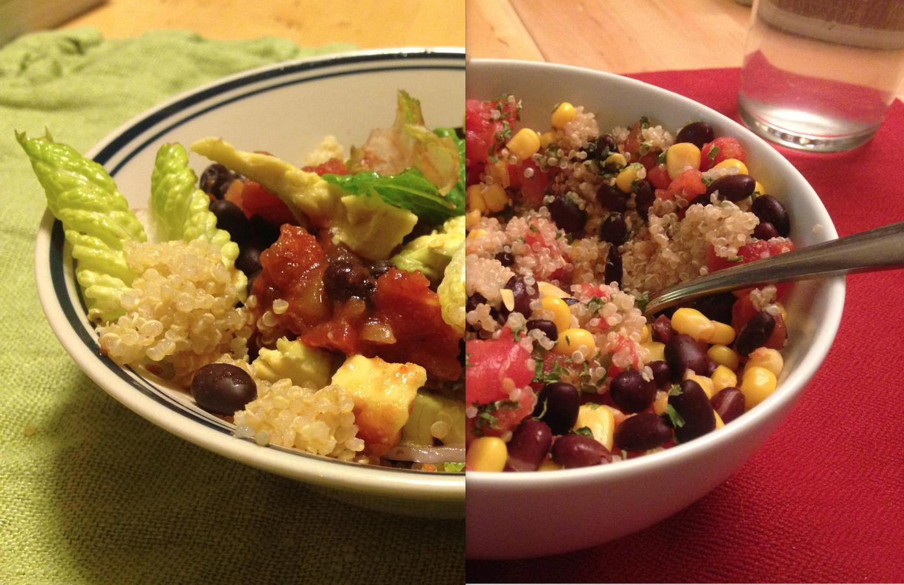

<!-- Do not modify. Auto-generated with mkdocs_migrate.py -->

# Quinoa And Stuff

Personal rating: :fontawesome-solid-star: :fontawesome-regular-star: :fontawesome-regular-star: :fontawesome-regular-star: :fontawesome-regular-star:

<!-- Image -->
{: .image-recipe loading=lazy }
<!-- /Image -->

## Ingredients

## Recipe

* Prepare Quinoa: Bring 2 cups water and 1 cup quinoa to a boil. Cover with lid and cook for 15 minutes on low. Remove from heat and let sit for 5 minutes
* (optionally) sautée peppers and onions
* In a tupperware, combine a can each of black beans, tomatoes, and corn and microwave for ~2 minutes
* Mix everything together with your choice(s) of salsa, red pepper flakes, Sriracha, avocado chunks, lettuce, curry powder, etc.
