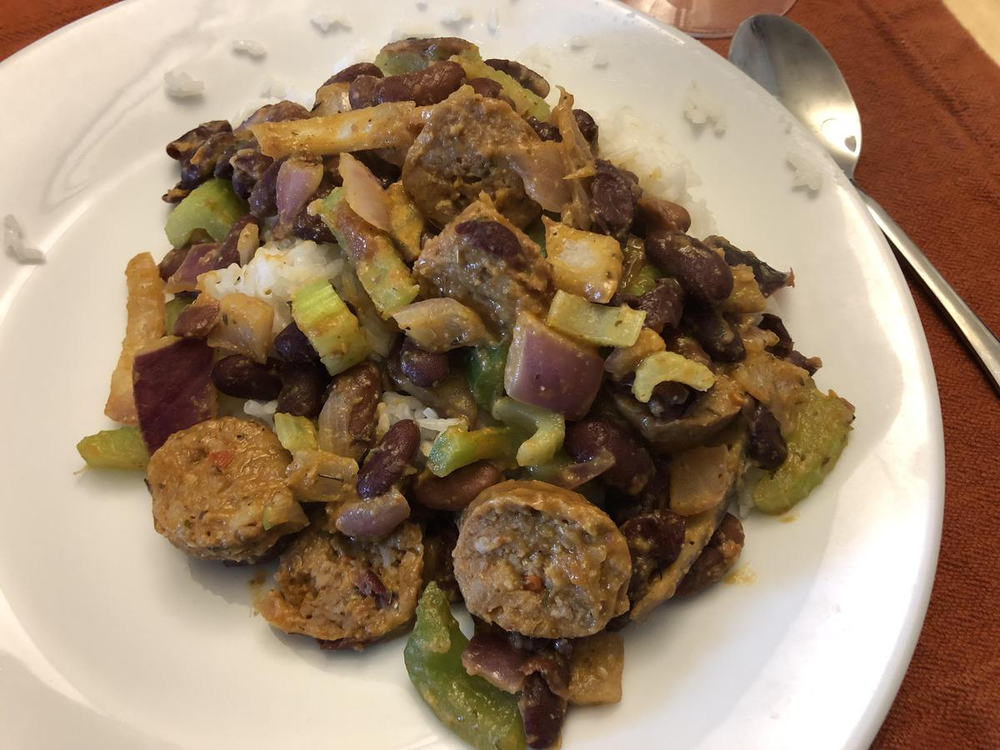

<!-- Do not modify sections with "AUTO-*". They are updated by make.py -->

# Red Beans And Rice

> Based on [http://www.delish.com/cooking/recipe-ideas/recipes/a54954/easy-red-beans-and-rice-recipe/](http://www.delish.com/cooking/recipe-ideas/recipes/a54954/easy-red-beans-and-rice-recipe/)

<!-- rating=1; (User can specify rating on scale of 1-5) -->
<!-- AUTO-UserRating -->
Personal rating: :fontawesome-solid-star: :fontawesome-regular-star: :fontawesome-regular-star: :fontawesome-regular-star: :fontawesome-regular-star:
<!-- /AUTO-UserRating -->

<!-- name_image=red_beans_and_rice.jpeg; (User can specify image name if multiple exist) -->
<!-- AUTO-Image -->
{: .image-recipe loading=lazy }
<!-- /AUTO-Image -->

## Ingredients

* [ ] Base
    * [ ] 2 cups white rice
    * [ ] 2 16-oz. cans red beans, drained and rinsed (*keep 2-3 tbsp liquid)
    * [ ] 1 lb. andouille sausage, sliced
    * [ ] 1 bell pepper, chopped
    * [ ] 1 onion, chopped
    * [ ] (opt) 1 tbsp. green onions, sliced
* [ ] Seasonings
    * [ ] 1 tsp garlic powder (or 2 cloves)
    * [ ] 2 tsp. cayenne pepper
    * [ ] 1 tsp thyme (or 2 sprigs)
    * [ ] 1 tsp. dried oregano
    * [ ] salt & pepper
    * [ ] 2 tsp. hot sauce

## Recipe

* In a medium pot over medium heat, heat oil. Slice the sausage and cook in the pot until slightly browned
* Add onion and the pepper. Cook until slightly softened
* Stir in the beans, saved bean liquid, and seasonings. Simmer for 10 minutes
* Serve over rice and garnish with green onions

## Notes

* Pretty spicy and simple. Otherwise not much of note
