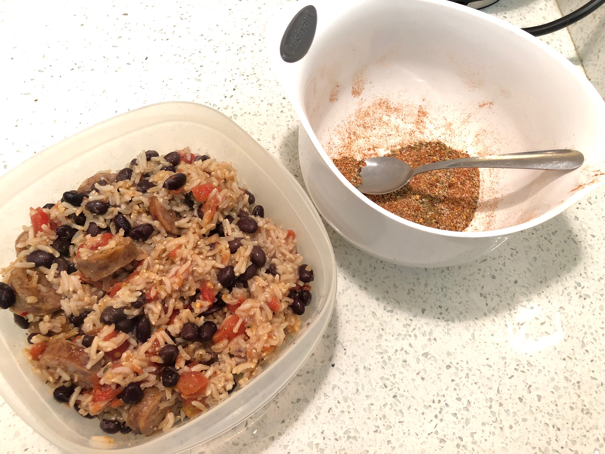

<!-- Do not modify sections with "AUTO-*". They are updated by make.py -->

# Spicy Cajun Sausage And Rice

> Based on [https://www.allrecipes.com/recipe/149221/cajun-spice-mix/](https://www.allrecipes.com/recipe/149221/cajun-spice-mix/)

<!-- rating=1; (User can specify rating on scale of 1-5) -->
<!-- AUTO-UserRating -->
Personal rating: :fontawesome-solid-star: :fontawesome-solid-star: :fontawesome-solid-star: :fontawesome-solid-star: :fontawesome-regular-star: :fontawesome-regular-star: :fontawesome-regular-star: :fontawesome-regular-star:
<!-- /AUTO-UserRating -->

<!-- name_image=spicy_cajun_sausage_and_rice.jpeg; (User can specify image name if multiple exist) -->
<!-- AUTO-Image -->
{: .image-recipe loading=lazy }
<!-- /AUTO-Image -->

## Ingredients

* [ ] main
    * [ ] Brown Rice
    * [ ] Sausage
    * [ ] Canned Black Beans
    * [ ] Canned Diced Tomatoes
* [ ] seasoning
    * [ ] 2 tsp salt
    * [ ] 2 tsp garlic powder
    * [ ] 2.5 tsp paprika
    * [ ] 1 tsp ground black pepper
    * [ ] 1 tsp onion powder
    * [ ] 1 tsp cayenne pepper
    * [ ] 1.25 tsp dried oregano
    * [ ] 1.25 tsp dried thyme
    * [ ] 1/2 tsp red pepper flakes

## Recipe

* Cook the rice
* Bake the sausage (see directions below. 400F for 15 min, then flip for ~10)
* Mix the seasoning (unless you already have Cajun seasoning) and toss together
