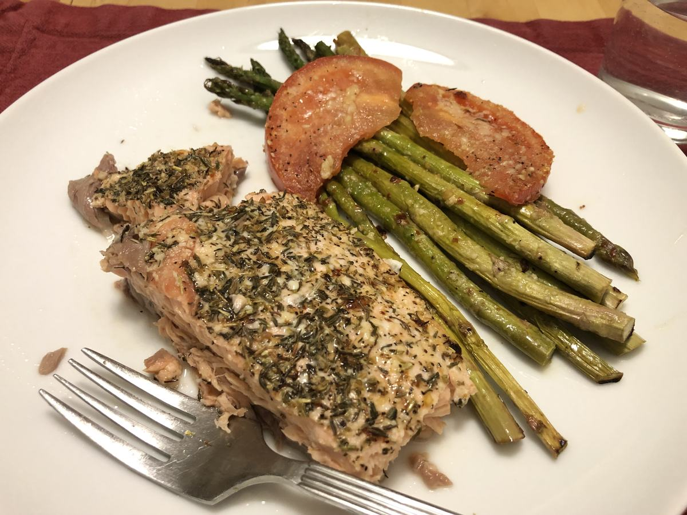

# Baked Fish and Asparagus

<!-- {cts} rating=5; (User can specify rating on scale of 1-5) -->
Personal rating: :fontawesome-solid-star: :fontawesome-solid-star: :fontawesome-solid-star: :fontawesome-solid-star: :fontawesome-solid-star: :fontawesome-solid-star: :fontawesome-solid-star: :fontawesome-solid-star:
<!-- {cte} -->

<!-- {cts} name_image=baked-fish-and-asparagus.jpeg; (User can specify image name) -->
{: .image-recipe loading=lazy }
<!-- {cte} -->

## Ingredients

- In a small bowl, whisk together
    - [ ] Olive Oil (~1/4 cup)
    - [ ] 1/8 tsp of paprika
    - [ ] 1/8 tsp cayenne pepper
    - [ ] 2/3 tbsp lemon juice
    - [ ] pinch of salt
- [ ] Salmon filet
- [ ] Tomato, thinly sliced
- [ ] (Optional) Asparagus
- [ ] Parmesan cheese
- [ ] Rosemary
- [ ] Thyme
- [ ] Oregano
- [ ] Salt and Pepper
- [ ] Could also add Parsely and/or Basil

## Recipe

- Preheat oven to 400F
- Whisk together the olive oil and lemon juice
- Cover a baking sheet with tin foil and lay out the fish, asparagus, tomatoes, and/or any other baked items
- Spread out the oil with a spoon and roll to coat. *
- Sprinkle on the additional herbs and cheese
- Bake for 15-25 min depending on thickness with most being around 20 min
