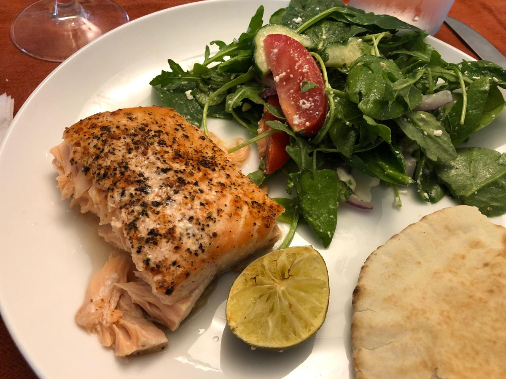

# Baked Fish

<!-- {cts} rating=4; (User can specify rating on scale of 1-5) -->
Personal rating: :fontawesome-solid-star: :fontawesome-solid-star: :fontawesome-solid-star: :fontawesome-solid-star: :fontawesome-solid-star: :fontawesome-solid-star: :fontawesome-solid-star: :fontawesome-regular-star:
<!-- {cte} -->

<!-- {cts} name_image=baked-fish.jpeg; (User can specify image name) -->
{: .image-recipe loading=lazy }
<!-- {cte} -->

## Ingredients

- [ ] __Olive Oil and Lemon__: [this is so good that it gets it own page](./baked-fish-and-asparagus.md) (Can be made with asparagus and tomato)
- [ ] __Chef's John's Salmon__ [is also has a separate page ](./chef_johns_salmon.md)
- [ ] __Lime-Baked__ (Based on [this](https://juliasalbum.com/easy-baked-salmon-garlic-lime-butter-sauce/) and [this](https://www.cookingclassy.com/baked-salmon-brown-sugar-lime/))
    - [ ] 1 lb fillet
    - [ ] In a bowl, mix:
        - [ ] 1/2 tbsp brown sugar
        - [ ] 1/4 tsp cayenne
        - [ ] 1/2 of a lime, zest and juice
        - [ ] 1/4 tsp garlic
    - [ ] 1/4 tbsp butter, sliced (placed on fish before baking)
    - [ ] 1/2 of a lime, sliced for garnish
- [ ] __Tomato Basil__ (Based on [this](https://www.allrecipes.com/recipe/166624/tomato-basil-salmon/))
    - [ ] 12 oz fillet
    - [ ] salt and pepper
    - [ ] 1/2 tbsp dried basil
    - [ ] tomato, thinly sliced
    - [ ] olive oil
    - [ ] Parmesan cheese

## Recipe

* Preheat oven to 400F
* Cover a baking sheet with tin foil and prep the fish
    * For the _Lime-Baked_ variant, mix all of the spices in a small bowl and brush onto the fish. Then place the butter slices on top of the fish
    * For the _Tomato Basil_ variant, drizzle the olive oil, sprinkle the basil and pepper, add the tomatoes, then sprinkle with the Parmesan cheese
* Bake for 15-25 min depending on thickness with most being around 20 min

!!! note
    For *thin* frozen fillet, bake at 450F for 4 minutes, then flip and bake for 8-12 min ([frozen recipe source](http://cookthestory.com/how-to-cook-fish-from-frozen/))
