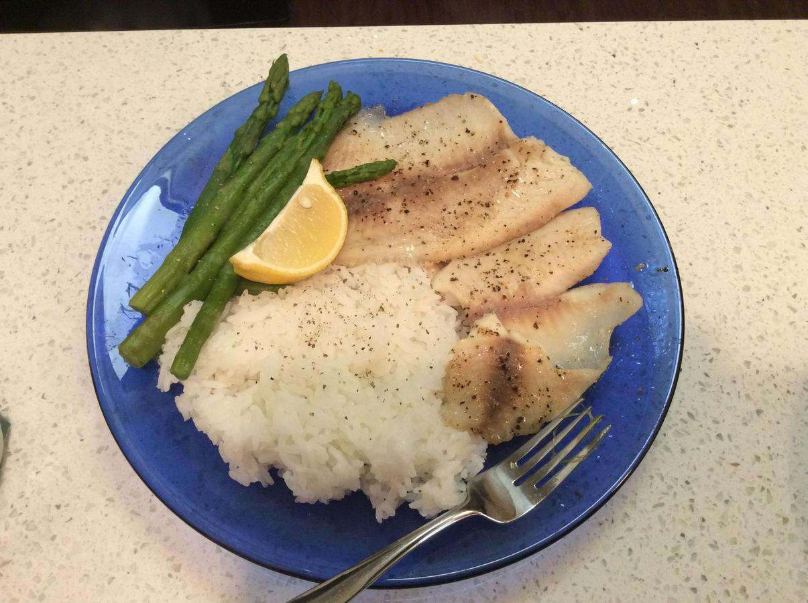

<!-- Do not modify. Auto-generated with mkdocs_migrate.py -->

# Baked-Fish

Personal rating: :fontawesome-solid-star: :fontawesome-regular-star: :fontawesome-regular-star: :fontawesome-regular-star: :fontawesome-regular-star:

<!-- Image -->
{: .image-recipe loading=lazy }
<!-- /Image -->

## Ingredients

* [ ] General
    * [ ] fish fillet
    * [ ] salt
    * [ ] black pepper
    * [ ] olive oil
* [ ] Paprika-Salmon
    * [ ] butter + salt + pepper
    * [ ] broil with paprika

## Recipe

* Preheat oven to 400F
* Cover a baking sheet with tin foil and prep the fish
* Bake 25-30 minutes for large fillets (>1 inch tall) and 15-20 for thin ones

## Notes

* For (thin) frozen fillet, bake at 450F for 4 minutes, then flip and bake for 8-12 min. Cover with olive oil, salt, and pepper. Frozen Recipe Source: http://cookthestory.com/how-to-cook-fish-from-frozen/
