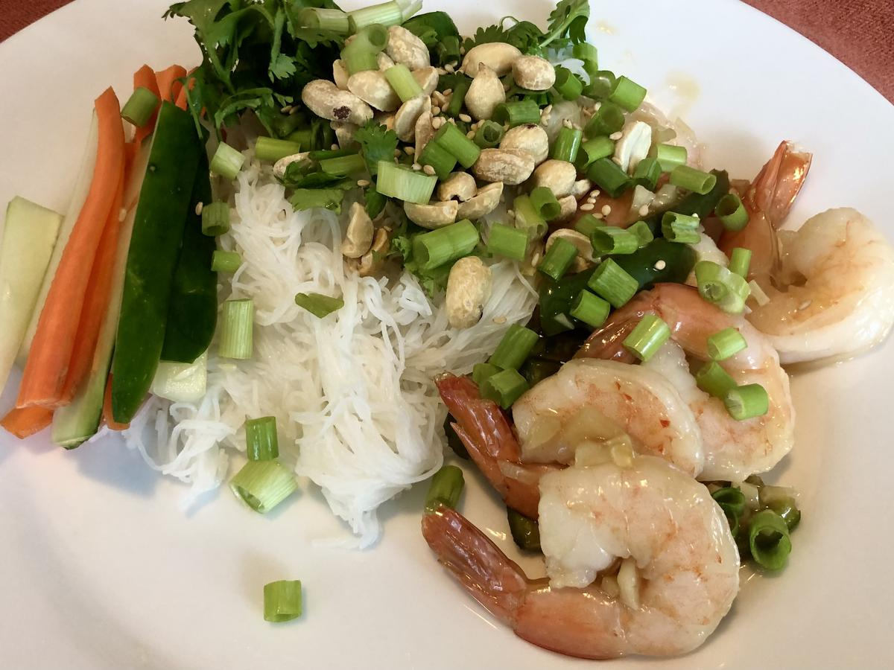

# Garlic Lime Shrimp Rice Noodles

> Based on [https://www.theflavorbender.com/garlic-lime-shrimp-rice-noodles/#recipe](https://www.theflavorbender.com/garlic-lime-shrimp-rice-noodles/#recipe)

<!-- {cts} rating=2; (User can specify rating on scale of 1-5) -->

Personal rating: :fontawesome-solid-star: :fontawesome-solid-star: :fontawesome-regular-star: :fontawesome-regular-star: :fontawesome-regular-star:

<!-- {cte} -->

<!-- {cts} name_image=garlic_lime_shrimp_rice_noodles.jpeg; (User can specify image name) -->

{.image-recipe}

<!-- {cte} -->

## Ingredients

### Shrimp

- [ ] 1 lb large shrimps peeled, de-veined
- [ ] Generous pinch of salt
- [ ] 1 Tbsp lime juice

### Garlic Lime Sauce (Nuoc Cham Sauce)

- [ ] 8 garlic cloves
- [ ] 6 Tbsp lime juice
- [ ] 5 Tbsp brown sugar
- [ ] 2/3 cup water
- [ ] 2 Tbsp fish sauce
- [ ] 4 tsp cornstarch and 2 *Tbsp* water
- [ ] 2-3 Thai red chili peppers, sliced deseeded OR 1 tsp sambal oelek OR see below

### Noodle Salad

- [ ] 7 oz dry rice noodles flat rice noodles or thin noodles
- [ ] shredded lettuce
- [ ] 1 large carrot, julienned
- [ ] 1/2 cucumber, julienned
- [ ] cilantro
- [ ] 4 spring onions sliced thin
- [ ] Roasted peanuts chopped

## Recipe

- Prep the vegetables and set aside
- Pat shrimp dry and toss with salt
    - Pan fry in a skillet on medium-high heat. Cook each side for 2-3 minutes until slightly caramelized. Cook in batches to avoid overcrowding
    - Toss the cooked shrimp with the fresh lime juice in a bowl and set aside
- Boil water and cook the noodles according to the package directions
- Garlic Lime Sauce
    - Mix the 1 Tbsp water with the cornstarch. Mix it into a slurry and set aside
    - In the same saucepan, bring *most of* the sauce ingredients to a boil on medium heat (garlic, lime juice, brown sugar, water, fish sauce) until the sugar is dissolved
    - Whisk in the cornstarch slurry and the chili peppers
    - Cook for another 2 more minutes until a thick, sauce-like consistency. Season with extra salt or fish sauce if needed
    - Add one half of the garlic lime sauce to the shrimp and toss to combine. Set aside the rest of the sauce
- Plate the lettuce, noodles, cucumber, carrots, cilantro, and shrimp. Sprinkle with spring onions and chopped peanuts. Drizzle with the remaining sauce

## Notes

- If you can't find Thai Chiles, you can substitute them with Serrano peppers or *diced* jalapenos along with a tsp of Red Pepper Flakes, Cayenne, or Hot Paprika to restore some of the heat
- Note: I tripled the sauce, but I would recommend just turning these into spring rolls instead
