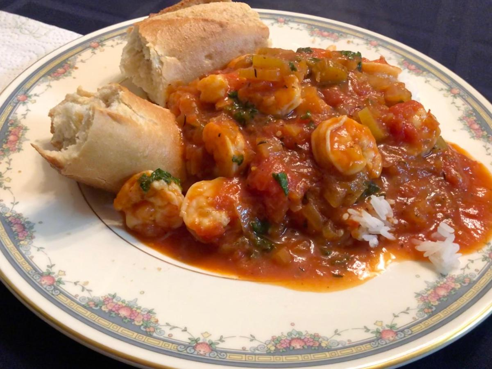

<!-- Do not modify sections with "AUTO-*". They are updated by make.py -->

# Shrimp Creole

<!-- rating=3; (User can specify rating on scale of 1-5) -->
<!-- AUTO-UserRating -->
Personal rating: :fontawesome-solid-star: :fontawesome-solid-star: :fontawesome-solid-star: :fontawesome-regular-star: :fontawesome-regular-star:
<!-- /AUTO-UserRating -->

<!-- name_image=shrimp_creole.jpeg; (User can specify image name if multiple exist) -->
<!-- AUTO-Image -->
{: .image-recipe loading=lazy }
<!-- /AUTO-Image -->

## Ingredients

* [ ] 1 (32 oz) can of tomato sauce
* [ ] 1/2 stick butter
* [ ] 1.5 onions, diced
* [ ] 1.5 stalks celery, half rings
* [ ] 1.5 garlic cloves
* [ ] 1 (15 oz) can whole tomatoes, cut into quarters (with scissors)
* [ ] 1 bay leaf
* [ ] 1/2 tsp Tabasco sauce
* [ ] 1/2 tbsp fresh thyme
* [ ] 1/4 bunch parsley, chopped (about 1-2 tsp)
* [ ] 1 lbs raw shrimp, peeled and deveined
* [ ] pinch of saffron and white rice OR side baguette

## Recipe

* Reduce tomato sauce by 3/4 (bake uncovered in 350 oven - ~90 minutes). Add water back to original volume
* In butter, saute the onion, celery, and garlic
* Add sauted ingredients, sliced tomatoes, and spices to the pot with tomato sauce from the oven
* Bake covered for 30 min; uncover and bake for 30 additional minutes
* (*Can stop here to store overnight in the fridge)
* (Optional) Prep white rice. Add the pinch of saffron before starting the rice cooker and stir. Once done, the rice should be bright yellow
* Bring to a boil. Add parsley and shrimp then cook for 5 more minutes. Serve over warm saffron rice or with a baguette

## Notes

* Alex's family recipe
* This recipe has been cut in half to serve 3-4 people
