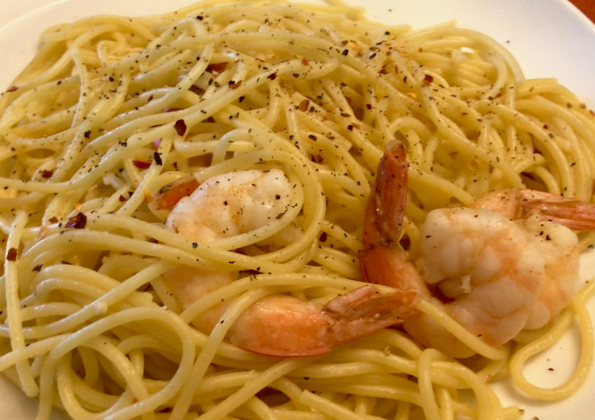

<!-- Needs Manual Review -->

# Shrimp Scampi

> Based on [https://cooking.nytimes.com/recipes/9101-classic-shrimp-scampi](https://cooking.nytimes.com/recipes/9101-classic-shrimp-scampi)

<!-- {cts} rating=3; (User can specify rating on scale of 1-5) -->
Personal rating: :fontawesome-solid-star: :fontawesome-solid-star: :fontawesome-solid-star: :fontawesome-solid-star: :fontawesome-solid-star: :fontawesome-solid-star: :fontawesome-regular-star: :fontawesome-regular-star:
<!-- {cte} -->

<!-- {cts} name_image=shrimp_scampi.jpeg; (User can specify image name) -->
{: .image-recipe loading=lazy }
<!-- {cte} -->

## Ingredients

* [ ] 1/2 box of spaghetti or linguine
* [ ] 3 tbsp butter
* [ ] 4 tbsp extra-virgin olive oil
* [ ] 6 garlic cloves, minced
* [ ] 1/2 cup dry white wine
* [ ] 3/4 tsp kosher salt
* [ ] 1/2 tsp crushed red pepper flakes, or to taste
* [ ] ~2 tsp ground black pepper
* [ ] 1-2 lbs raw (defrosted) shrimp, peeled and deveined (can be shell-on)
* [ ] 1/3 cup chopped parsley
* [ ] Lemon juice, half of a lemon
* [ ] Parmesan cheese

## Recipe

* Make the pasta according to directions
* In a large skillet, melt butter with olive oil. Add garlic and saute until fragrant, about 1 minute
* Add wine, salt, red pepper flakes, and plenty of black pepper. Bring to a simmer and let the wine reduce by half, about 2 minutes.
* Add shrimp and saute until they just turn pink (2-4 min depending upon their size)
* Stir in the parsley and lemon juice and serve over pasta or accompanied by crusty bread.

## Notes

* *Save some of the starchy pasta water to help thicken up the sauce when combining
* Seasonings were slightly increase to taste. Could also be served with bread, but the ratios may need to be adjusted
* Btw, Scampi are a small lobster common in the North Atlantic/Mediterranean, but Shrimp is commonly substituted, especially in the US
