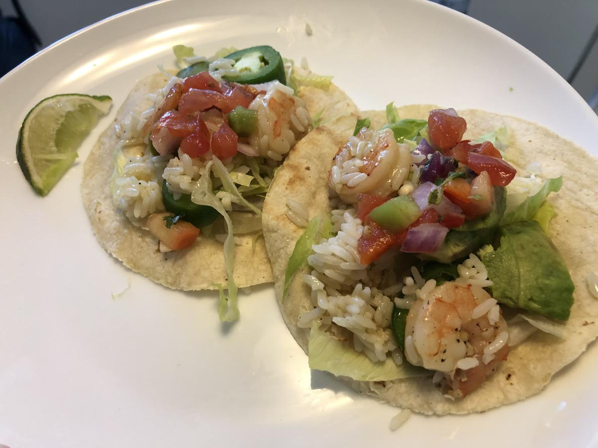

# Shrimp Tacos

> Based on [http://www.yummly.co/recipe/Honey-Lime-Shrimp-Tacos-1576139](http://www.yummly.co/recipe/Honey-Lime-Shrimp-Tacos-1576139)

<!-- {cts} rating=4; (User can specify rating on scale of 1-5) -->

Personal rating: :fontawesome-solid-star: :fontawesome-solid-star: :fontawesome-solid-star: :fontawesome-solid-star: :fontawesome-regular-star:

<!-- {cte} -->

<!-- {cts} name_image=shrimp_tacos.jpg; (User can specify image name) -->

{: .image-recipe loading=lazy }

<!-- {cte} -->

## Ingredients

### Shrimp

- [ ] 1 lb shrimp, peeled
- [ ] 1/4 cup olive oil
- [ ] 2.5 tbsp honey
- [ ] 1 lime, juiced
- [ ] 3 cloves garlic
- [ ] (optional) small slice of a jalapeño or pinch of red pepper flakes
- [ ] 1/2 tsp each of salt & pepper

### Tacos

- [ ] Hard corn or soft flour tacos, toasted
- [ ] Avocado
- [ ] Salsa
- [ ] Shredded Lettuce
- [ ] Jalapeño, sliced
- [ ] Rice
- [ ] Diced onion, tomato, etc.

## Recipe

- Whisk together the olive oil, honey, lime juice, garlic, salt, and pepper
- Simmer the sauce in a sauce pan for a few minutes, then add the shrimp
- Cook shrimp on one side until pink, then flip, and cook until just pink all over (~6 min)
