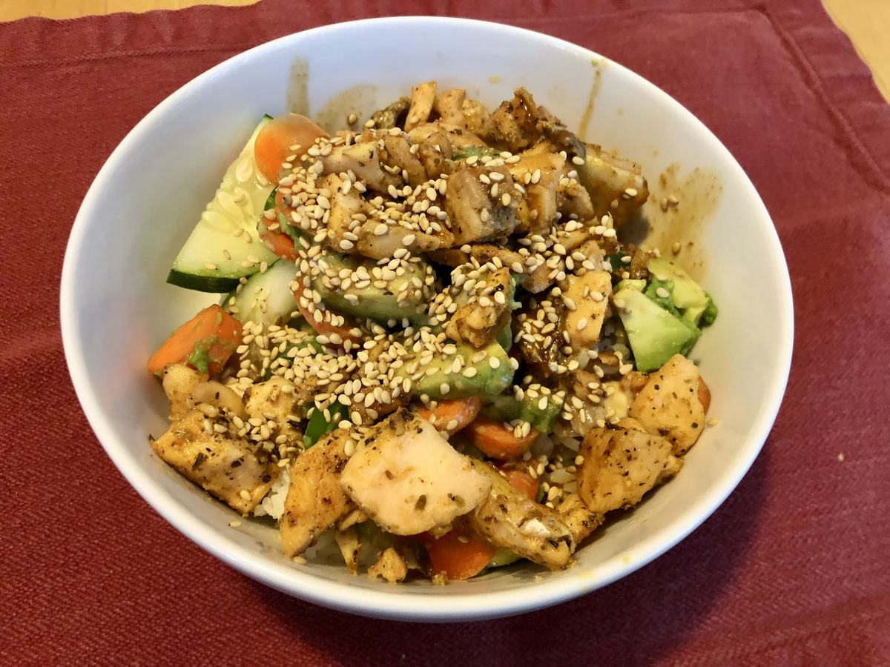

# Spicy Salmon Roll Bowls

> Based on [https://healthyishfoods.com/spicy-salmon-roll-bowls/](https://healthyishfoods.com/spicy-salmon-roll-bowls/)

<!-- {cts} rating=4; (User can specify rating on scale of 1-5) -->

Personal rating: :fontawesome-solid-star: :fontawesome-solid-star: :fontawesome-solid-star: :fontawesome-solid-star: :fontawesome-regular-star:

<!-- {cte} -->

<!-- {cts} name_image=spicy_salmon_roll_bowls.jpeg; (User can specify image name) -->

{: .image-recipe loading=lazy }

<!-- {cte} -->

## Ingredients

### Blackening Spice

- [ ] 1 tsp oregano
- [ ] 1/2 tsp garlic powder
- [ ] 1/2 tsp onion powder
- [ ] 1/4 tsp salt
- [ ] 1/4 tsp black pepper
- [ ] 1/4 tsp cayenne pepper
- [ ] 1/4 tsp paprika

### Salmon Bowls

- [ ] 12 oz salmon, cubed and seasoned
- [ ] 1 cup white rice uncooked
- [ ] 2 carrots, thin-sliced
- [ ] 1/4 cup cucumber, thin-sliced
- [ ] 1/2 avocado, thin-sliced
- [ ] 1/4 cup green onions, chopped
- [ ] 1 tbsp jalapeno, thin-sliced
- [ ] 2 tbsp cilantro, chopped
- [ ] and/or peanuts, broccoli (chopped), peas, or other vegetables
- [ ] toasted sesame seeds or 2 tsp furikake, split between the bowls
- [ ] 1 large lime, quartered

### Spicy Sauce

- [ ] 1/4 cup mayonnaise
- [ ] 1 tbsp sriracha
- [ ] 2 tbsp soy sauce, low sodium
- [ ] 1 tsp brown sugar or 2 tsp syrup

## Recipe

- Cook the rice
- Prep in bowls:
    - Combine the blackening spice
    - Combine the mayonnaise, sriracha, soy sauce, and maple syrup. Whisk until well combined
- Chop and prep the rest of the vegetables
- Remove salmon skin, then cube into bite-sized pieces
    - Toss with the blackening spice
    - In a skillet, pan fry the salmon for 3-4 minutes in olive oil on medium-high heat
- Add the rice as a base, then top with the sliced avocado, chopped green onion, sliced jalapeno, sliced cucumber, and seared salmon cubes
    - Finish with cilantro, fresh squeezed lime, sesame seeds/furikake, and spicy sauce
