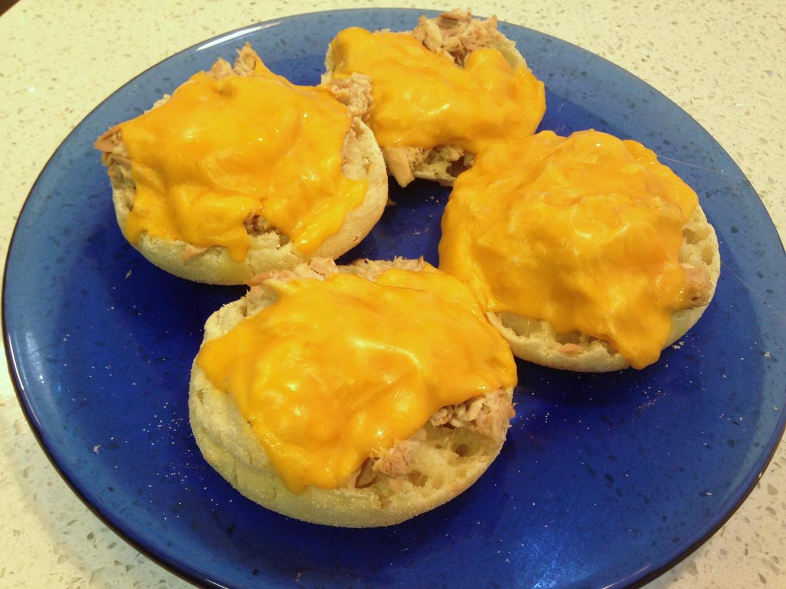

# Tuna Melts

<!-- {cts} rating=1; (User can specify rating on scale of 1-5) -->

Personal rating: :fontawesome-solid-star: :fontawesome-regular-star: :fontawesome-regular-star: :fontawesome-regular-star: :fontawesome-regular-star:

<!-- {cte} -->

<!-- {cts} name_image=tuna_melts.jpg; (User can specify image name) -->

{.image-recipe}

<!-- {cte} -->

## Ingredients

- [ ] 1 Tbsp Mayonnaise
- [ ] 2 cans of Tuna
- [ ] 4-5 English Muffins
- [ ] 1 pickle
- [ ] Your Choice of Cheese slices

## Recipe

- Preheat oven to Broil (~10 min)
- Chop pickle and mix ingredients together. Toast English muffins
- On a foil-lined pan, cover the muffins with the tuna, then a slice of cheese. Broil until the cheese has melted

## Notes

- Can be made in a pinch by toasting the English muffins, then topping them and steaming them in a hot pan with a lid
