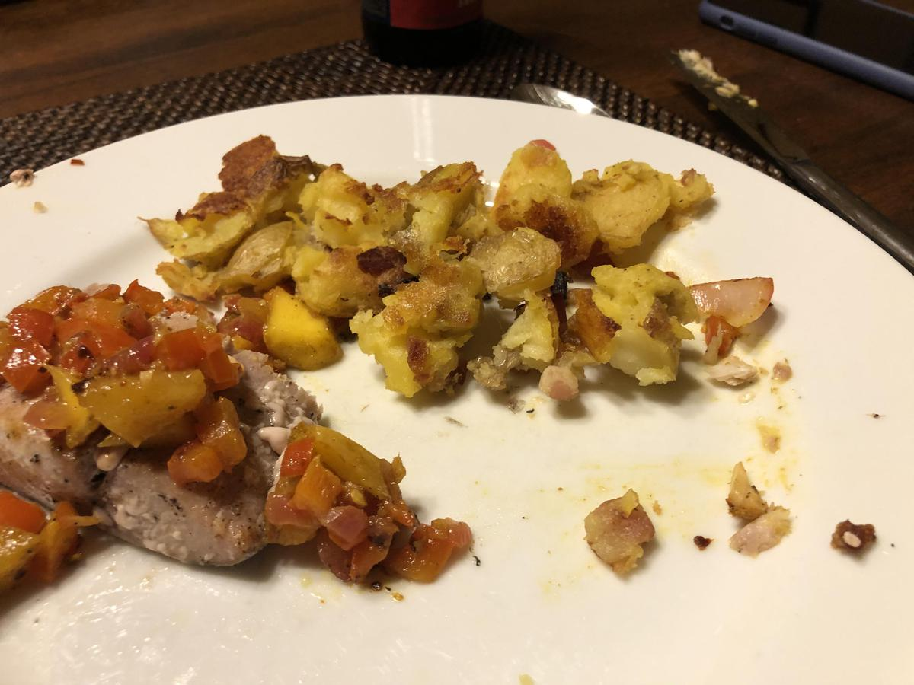

# Sides Table of Contents

- Bacon (:fontawesome-solid-star: :fontawesome-solid-star: :fontawesome-solid-star: :fontawesome-solid-star: :fontawesome-solid-star: :fontawesome-regular-star: :fontawesome-regular-star: :fontawesome-regular-star:)

    {: .image-recipe loading=lazy }

- Emily English Roasted Potatoes (*Not yet rated*)

    {: .image-recipe loading=lazy }

- Cheeses (:fontawesome-solid-star: :fontawesome-solid-star: :fontawesome-solid-star: :fontawesome-solid-star: :fontawesome-solid-star: :fontawesome-solid-star: :fontawesome-regular-star: :fontawesome-regular-star:)

    <!-- TODO: Capture image -->

- Bruschetta (*Not yet rated*)

    <!-- TODO: Capture image -->

- Aunt Laura'S Spicy Chicken Dip (:fontawesome-solid-star: :fontawesome-solid-star: :fontawesome-solid-star: :fontawesome-solid-star: :fontawesome-regular-star: :fontawesome-regular-star: :fontawesome-regular-star: :fontawesome-regular-star:)

    {: .image-recipe loading=lazy }

- Favorite Snacks (:fontawesome-solid-star: :fontawesome-solid-star: :fontawesome-solid-star: :fontawesome-solid-star: :fontawesome-regular-star: :fontawesome-regular-star: :fontawesome-regular-star: :fontawesome-regular-star:)

    {: .image-recipe loading=lazy }

- Pretzels (*Not yet rated*)

    <!-- TODO: Capture image -->

- Ikea Meatball Sauce (:fontawesome-solid-star: :fontawesome-solid-star: :fontawesome-solid-star: :fontawesome-solid-star: :fontawesome-solid-star: :fontawesome-regular-star: :fontawesome-regular-star: :fontawesome-regular-star:)

    {: .image-recipe loading=lazy }