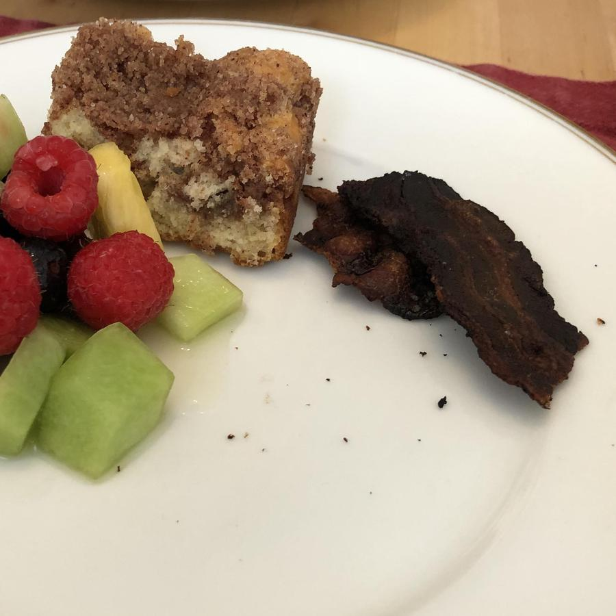

<!-- Do not modify. Auto-generated with mkdocs_migrate.py -->

# Bacon

Personal rating: :fontawesome-solid-star: :fontawesome-solid-star: :fontawesome-regular-star: :fontawesome-regular-star: :fontawesome-regular-star:

<!-- Image -->
{: .image-recipe loading=lazy }
<!-- /Image -->

## Ingredients

* [ ] BACON

## Recipe

* TODO: Need to revisit
* Preheat oven to 375
* Place bacon without overlapping on a wire drying rack over a rimmed baking sheet. Bake for 12-20 min

## Notes

* Note: don't use wire baking rack because difficult to clean without a dishwasher
