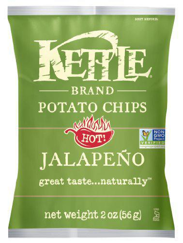

<!-- Needs Manual Review -->

<!-- Do not modify sections with "AUTO-*". They are updated by make.py -->

# Favorite Snacks

<!-- rating=1; (User can specify rating on scale of 1-5) -->
<!-- AUTO-UserRating -->
Personal rating: :fontawesome-solid-star: :fontawesome-solid-star: :fontawesome-solid-star: :fontawesome-solid-star: :fontawesome-regular-star: :fontawesome-regular-star: :fontawesome-regular-star: :fontawesome-regular-star:
<!-- /AUTO-UserRating -->

<!-- name_image=favorite_snacks.jpg; (User can specify image name if multiple exist) -->
<!-- AUTO-Image -->
{: .image-recipe loading=lazy }
<!-- /AUTO-Image -->

## Ingredients

* [ ] Dessert
    * [ ] Chocolate Butter Cream Frosting (avoid cream cheese frosting)
* [ ] Favorite Snacks
    * [ ] Kettle Jalapeno Chips
* [ ] Yogurt's
    * [ ] Chobani Cherry
    * [ ] Chobani Raspberry
    * [ ] Siggi's Raspberry
    * [ ] Siggi's Vanilla
* [ ] Seltzer
    * [ ] Grapefruit or lemon seltzer (avoid citrus & orange)

## Recipe

## Notes

*
