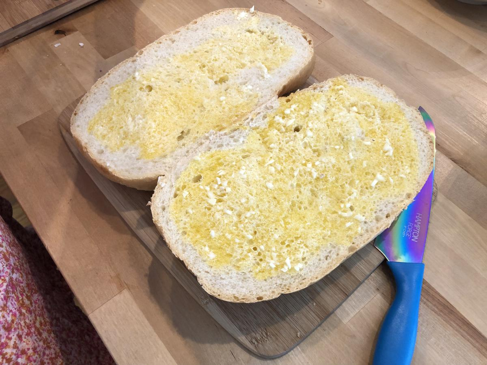

# Garlic Bread

> Based on [https://www.simplyrecipes.com/recipes/garlic_bread/](https://www.simplyrecipes.com/recipes/garlic_bread/) and [https://www.washingtonpost.com/recipes/triple-garlic-bread/17638](https://www.washingtonpost.com/recipes/triple-garlic-bread/17638)

<!-- {cts} rating=4; (User can specify rating on scale of 1-5) -->
Personal rating: :fontawesome-solid-star: :fontawesome-solid-star: :fontawesome-solid-star: :fontawesome-solid-star: :fontawesome-solid-star: :fontawesome-solid-star: :fontawesome-solid-star: :fontawesome-regular-star:
<!-- {cte} -->

<!-- {cts} name_image=garlic_bread.jpeg; (User can specify image name) -->
{: .image-recipe loading=lazy }
<!-- {cte} -->

## Ingredients

* [ ] ~2-4 Garlic Cloves, grated or very finely diced to a paste
* [ ] ~2-4 tbsp butter
* [ ] ~2 tbsp Extra-virgin Olive Oil
* [ ] 1/2 tsp kosher salt
* [ ] Bread Loaf
* [ ] ~3 tbsp Cheese, grated

## Recipe

* Position rack in middle to upper third of the oven. Preheat to 400F
* Combine everything except for the cheese in a microwave safe bowl and microwave until liquid (1 min + ~15s intervals)
* Spread evenly on each half and top with cheese
* Bake for 10-15 min until golden and crispy
    * Then turn up to a broil for a few minutes to finish
* Slice and serve

## Notes

* [Extra Tips](https://www.budgetbytes.com/garlic-bread/)
* Also consider chives or parsley
