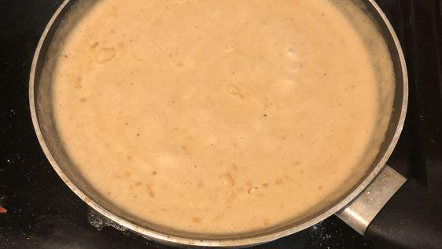

<!-- Needs Manual Review -->

# Ikea Meatball Sauce

> Based on [https://www.thegratefulgirlcooks.com/moms-swedish-meatballs-rice/](https://www.thegratefulgirlcooks.com/moms-swedish-meatballs-rice/)

<!-- {cts} rating=2; (User can specify rating on scale of 1-5) -->
Personal rating: :fontawesome-solid-star: :fontawesome-solid-star: :fontawesome-solid-star: :fontawesome-solid-star: :fontawesome-solid-star: :fontawesome-regular-star: :fontawesome-regular-star: :fontawesome-regular-star:
<!-- {cte} -->

<!-- {cts} name_image=ikea_meatball_sauce.jpeg; (User can specify image name) -->
{: .image-recipe loading=lazy }
<!-- {cte} -->

## Ingredients

* [ ] IKEA Meatballs!
* [ ] IKEA Meatball Sauce Packet

## Recipe

* Getting the meatball sauce packet is tricky. I found that adding a little bit of salt then thoroughly mixing provides the best change of achieving a smooth consistency

## Notes

* Note: source is for actually making meatballs and not just defrosting IKEA :)
