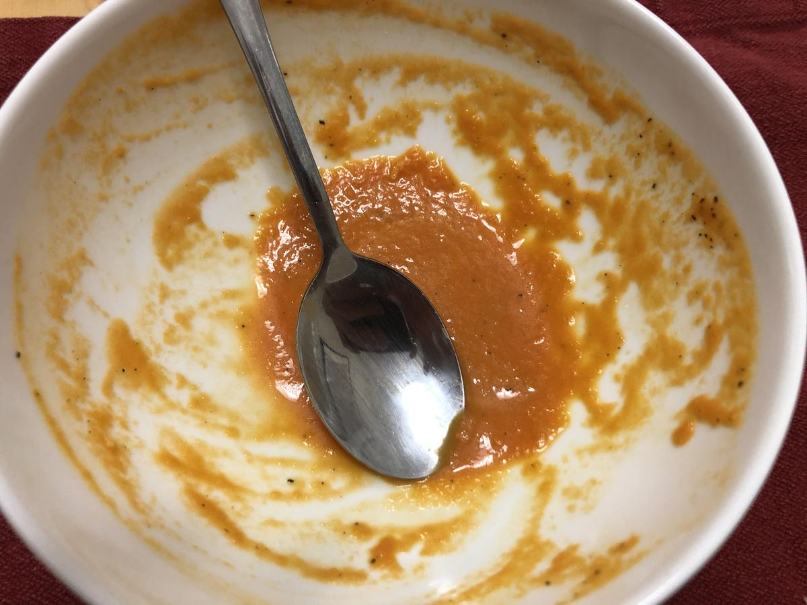

# Creamy Tomato Soup

> Based on [Chrissy Teigen Cravings], pg. 45

<!-- {cts} rating=0; (User can specify rating on scale of 1-5) -->

Personal rating: *Not yet rated*

<!-- {cte} -->

<!-- {cts} name_image=creamy_tomato_soup.jpeg; (User can specify image name) -->

{: .image-recipe loading=lazy }

<!-- {cte} -->

## Ingredients

- [ ] 3 tbsp Olive Oil
- [ ] 1 medium onion, cut into 1/2-in dice
- [ ] 4 cloves garlic, chopped
- [ ] 1 (28 oz) can whole peeled tomatoes in juice, roughly chopped
- [ ] 1 cup low sodium chicken or vegetable broth
- [ ] 1/2 tsp sugar
- [ ] salt and pepper
- [ ] 1/4 cup heavy cream
- [ ] Side bread

## Recipe

- In the dutch oven, heat oil and cook the onion until translucent (about 10 min). Add the garlic and cook an additional minute
- Add the tomatoes, juice, broth, sugar, 1 tsp salt, and 1/2 tsp pepper
- Bring to a boil then reduce heat to medium-low and simmer gently until liquid reduces slightly (~15 min)
- Let the soup cool for a few minutes then pour into a blender and blend on high speed until smooth for 1-2 min (note allow steam to escape)
- Add the cream and blend a few seconds more. Season with salt, pepper, and/or sugar to taste

[chrissy teigen cravings]: https://www.penguinrandomhouse.com/books/252973/cravings-by-chrissy-teigen-with-adeena-sussman/
