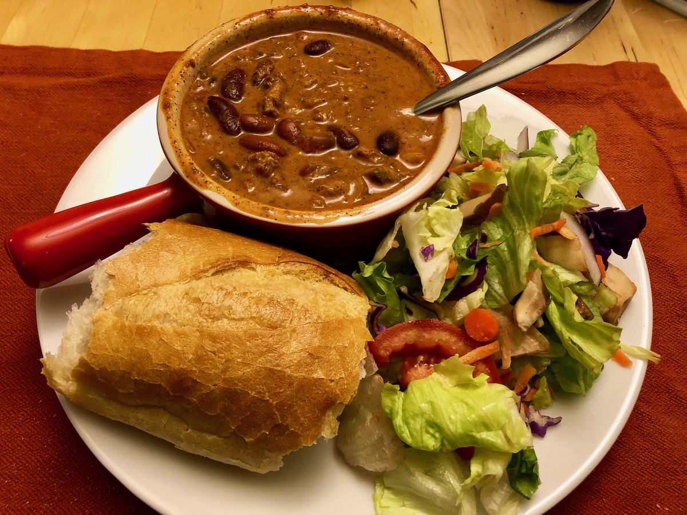

<!-- Needs Manual Review -->

# Johns Chili

> Based on [Chrissy Teigen Cravings], pg. 148

  [Chrissy Teigen Cravings]: https://www.penguinrandomhouse.com/books/252973/cravings-by-chrissy-teigen-with-adeena-sussman/

<!-- {cts} rating=2; (User can specify rating on scale of 1-5) -->
Personal rating: :fontawesome-solid-star: :fontawesome-solid-star: :fontawesome-solid-star: :fontawesome-solid-star: :fontawesome-solid-star: :fontawesome-regular-star: :fontawesome-regular-star: :fontawesome-regular-star:
<!-- {cte} -->

<!-- {cts} name_image=johns_chili.jpeg; (User can specify image name) -->
{: .image-recipe loading=lazy }
<!-- {cte} -->

## Ingredients

* [ ] Ingredients
    * [ ] 1 lb ground turkey
    * [ ] 1 medium onion, chopped
    * [ ] 1 cup mushrooms, chopped
    * [ ] 2 tbsp (Lawry's) seasoning salt (see substitute below)
    * [ ] 3 tbsp chili powder
    * [ ] 1 tsp cayenne pepper
    * [ ] 3 cloves garlic, minced
    * [ ] 2 cups water
    * [ ] 2 (15 oz) cans tomato sauce
    * [ ] 2 (15 oz) cans kidney beans
    * [ ] 2 tbsp light brown sugar
* [ ] Seasoning Salt Substitute
    * [ ] 1 tsp garlic powder
    * [ ] 1 tsp onion powder
    * [ ] 1 tsp paprika
    * [ ] 1 tsp ground tumeric
    * [ ] 1 tsp salt
    * [ ] 1 tsp white sugar
* [ ] Toppings
    * [ ] (Optional) Plain Yogurt
    * [ ] (Optional) Shredded cheese
    * [ ] (Optional) Crushed tortilla chips

## Recipe

* Heat a large pot over medium heat. Add the ground turkey, onion, mushrooms, seasoning salt (or substitute), chili powder, and cayenne
* Cook for 8 min. Add the garlic and cook for 1 additional min
* Add 2 cups water, the tomato sauce, kidney beans, brown sugar, and bring to a boil
* Reduce heat to medium-low and simmer for 35-45 min to thicken slightly and flavor-mingle

## Notes

* Freezes or can be stored in the fridge. Tastes great when reheated.
* Serves 6-8
