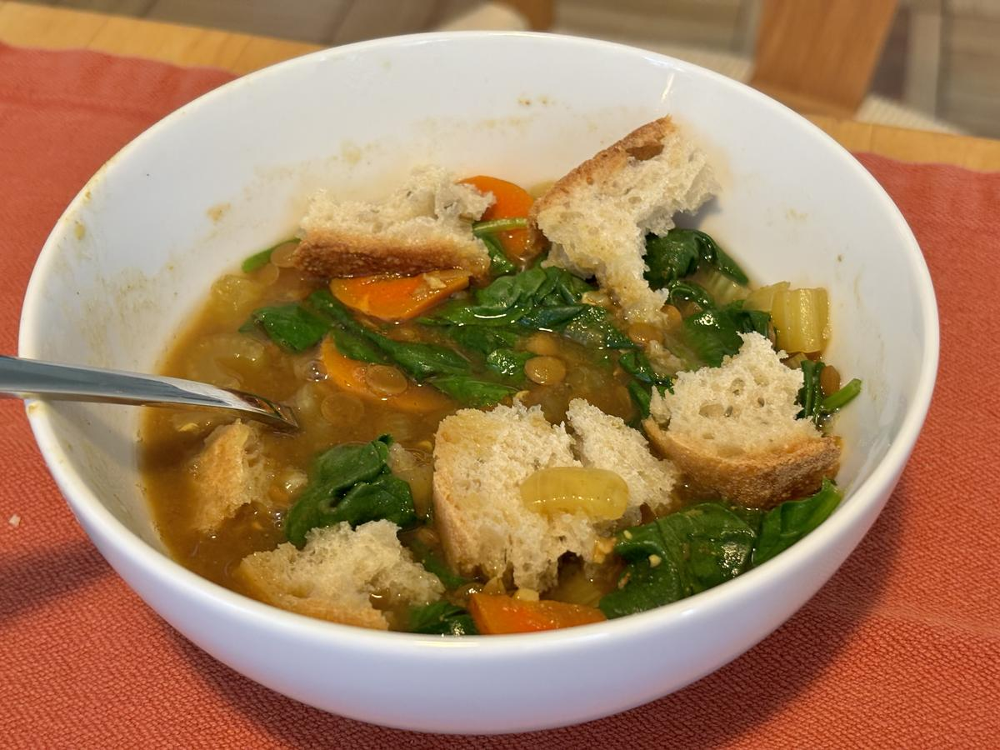

# Lentil Soup

> Based on [https://www.thepioneerwoman.com/food-cooking/recipes/a37975020/instant-pot-lentil-soup-recipe](https://www.thepioneerwoman.com/food-cooking/recipes/a37975020/instant-pot-lentil-soup-recipe)

<!-- {cts} rating=4; (User can specify rating on scale of 1-5) -->

Personal rating: :fontawesome-solid-star: :fontawesome-solid-star: :fontawesome-solid-star: :fontawesome-solid-star: :fontawesome-regular-star:

<!-- {cte} -->

<!-- {cts} name_image=lentil_soup.jpeg; (User can specify image name) -->

{.image-recipe}

<!-- {cte} -->

## Ingredients

### In Instant Pot

- [ ] 3 carrots, sliced
- [ ] 3-5 pieces of celery, chopped
- [ ] 1 onion, chopped
- [ ] 3 cloves of garlic, chopped
- [ ] 1.5 cups dried green or brown lentils, *rinsed*
- [ ] 7 cups vegetable broth
- [ ] 8 oz tomato sauce
- [ ] 1 Tbsp ground cumin
- [ ] 1.5 tsp ground coriander
- [ ] 1/2 tsp ground turmeric
- [ ] 1 bay leaf
- [ ] 1 tsp salt
- [ ] 1/2 tsp ground black pepper

### Added Last

- [ ] 8 oz baby spinach
- [ ] Parmesan, for serving
- [ ] Crusty bread, for serving

## Recipe

- In an Instant Pot, combine the ingredients
- Select high pressure for 10 minutes
- Quick release and remove the bay leaf
- Stir in the spinach and let wilt
- Serve the soup with grated Parmesan, fresh black pepper, and side of bread
