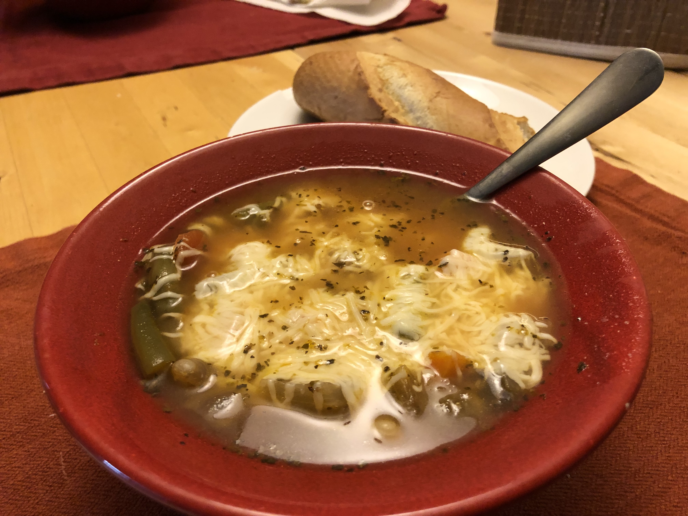

# Parmesan Minestrone

> Based on [Chrissy Teigen Cravings Hungry for More], pg. 50



Personal rating: :fontawesome-solid-star: :fontawesome-solid-star: :fontawesome-solid-star: :fontawesome-solid-star: :fontawesome-solid-star:

{}



{.image-recipe}

{}

## Ingredients

- [ ] 3 Tbsp olive oil
- [ ] 1 large yellow onion, cut into 1/2" dice
- [ ] 6 cloves garlic (3 tsp), diced
- [ ] 4 medium carrots, halved and coined
- [ ] 2 celery sticks, cut into 1/2" dice
- [ ] 3-4 cups vegetable or chicken broth
- [ ] 1 (28-oz) can of diced tomatoes (keep juice)
- [ ] 1 (15-oz) can cannellini (navy) beans, drained and rinsed
- [ ] 1 (15-oz) can green beans (keep juice)
- [ ] 1 tsp dried basil
- [ ] 1 tsp dried oregano
- [ ] 1.5 tsp salt
- [ ] 1/2 tsp black pepper
- [ ] 1/4 tsp red pepper flakes
- [ ] 2/3 cup pasta wheels (~1/2 cup elbow/macaroni)
- [ ] 1 cup Parmigiano-Reggiano cheese, plus more for garnish
- [ ] Serve with baguette or toast

## Recipe

- In a large ceramic dutch oven, heat the oil over medium heat. Add onion and cook ~8 min until tender. Add garlic and cook 1 additional minute
- Add the carrots and celery and cook ~4 min until slightly softened
- Add the broth, the three canned ingredients, and spices. Bring to a boil then reduce to a simmer and cook for 20 min until thickened
- Add the pasta and cook until tender for another ~10 min
- Stir in the Parmesan and season with additional salt and black pepper.

[chrissy teigen cravings hungry for more]: https://www.penguinrandomhouse.com/books/553580/cravings-hungry-for-more-by-chrissy-teigen-with-adeena-sussman/
