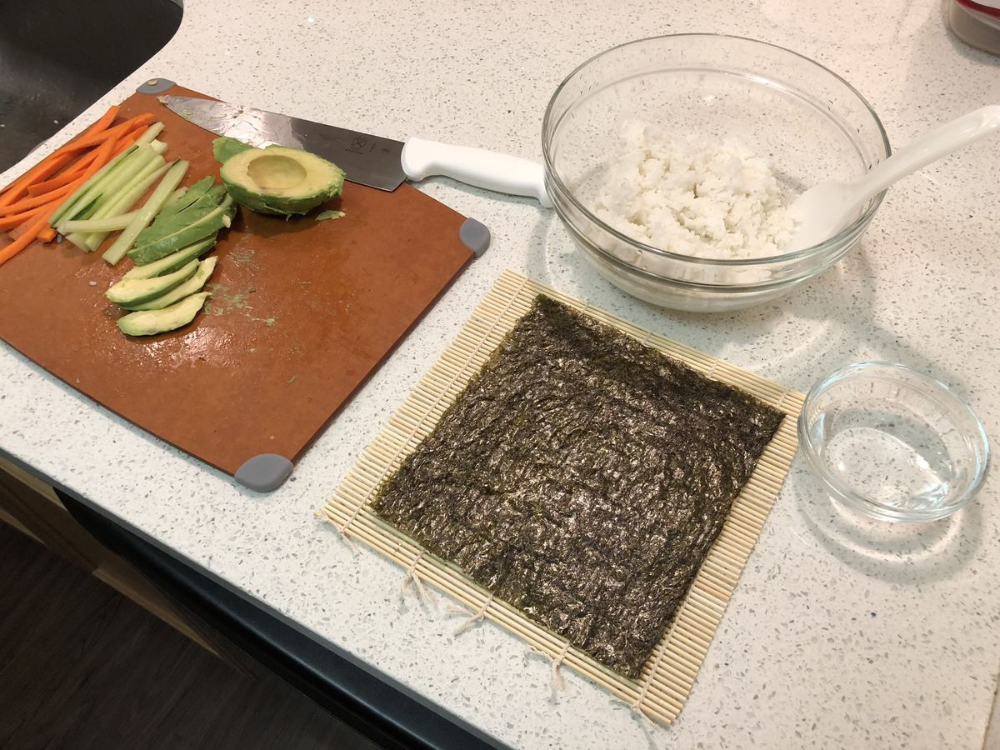

<!-- Needs Manual Review -->

# Rice

> Based on [https://recipes.instantpot.com/recipe/pressure-cooker-sushi-rice/](https://recipes.instantpot.com/recipe/pressure-cooker-sushi-rice/)

<!-- rating=1; (User can specify rating on scale of 1-5) -->
<!-- AUTO-UserRating -->
Personal rating: :fontawesome-solid-star: :fontawesome-solid-star: :fontawesome-solid-star: :fontawesome-solid-star: :fontawesome-regular-star: :fontawesome-regular-star: :fontawesome-regular-star: :fontawesome-regular-star:
<!-- /AUTO-UserRating -->

<!-- name_image=_rice.jpg; (User can specify image name) -->
<!-- AUTO-Image -->
{: .image-recipe loading=lazy }
<!-- /AUTO-Image -->

## Ingredients

* [ ] 1 cup sushi rice, rinsed
* [ ] 1.5 cups water
* [ ] 3 tbsp rice vinegar (or 1 tbsp cider vinegar)
* [ ] Instant Pot

## Recipe

* Rinse the rice in a strainer for ~2 min. Shake dry
* In the instant pot, even distribute the rice in the water
* Set to rice/low pressure for 12 minutes
* When done, gently stir in the rice vinegar
* Spread the rice into a thin layer on a wooden cutting board and let cool for 10 minutes
