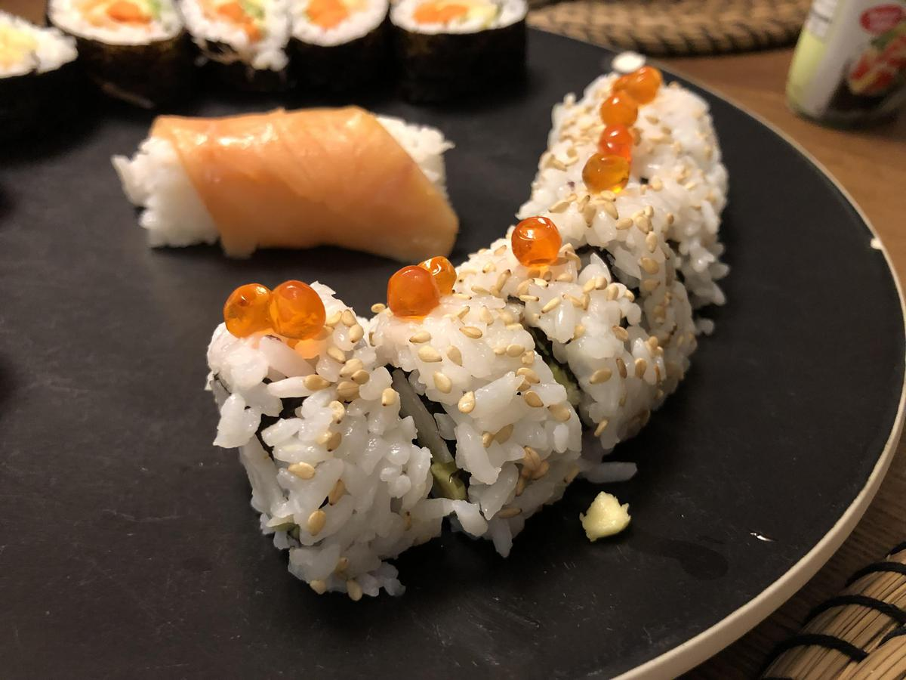

<!-- Needs Manual Review -->

<!-- Do not modify sections with "AUTO-*". They are updated by make.py -->

# California Rolls

> Based on [https://makemysushi.com/Recipes/how-to-make-california-sushi-rolls](https://makemysushi.com/Recipes/how-to-make-california-sushi-rolls)

<!-- rating=1; (User can specify rating on scale of 1-5) -->
<!-- AUTO-UserRating -->
Personal rating: :fontawesome-solid-star: :fontawesome-solid-star: :fontawesome-solid-star: :fontawesome-solid-star: :fontawesome-regular-star: :fontawesome-regular-star: :fontawesome-regular-star: :fontawesome-regular-star:
<!-- /AUTO-UserRating -->

<!-- name_image=california_rolls.jpeg; (User can specify image name if multiple exist) -->
<!-- AUTO-Image -->
{: .image-recipe loading=lazy }
<!-- /AUTO-Image -->

## Ingredients

* [ ] 6 sticks Surimi (Imitation crab)
* [ ] 1/2 avocado
* [ ] cucumber
* [ ] sesame seeds
* [ ] sushi rice
* [ ] nori
* [ ] masago (flying fish roe) or tobikko

## Recipe

* Cut the Nori sheet in half. Spread rice over the nori and top with sesame seeds, then flip rice side down
* Add strips of the Surimi, avocado, cucumber, and choice of fish roe then roll

## Notes

* tobiko is just fish eggs with corn syrup and food coloring
* See more detailed guide: https://www.justonecookbook.com/california-roll/
