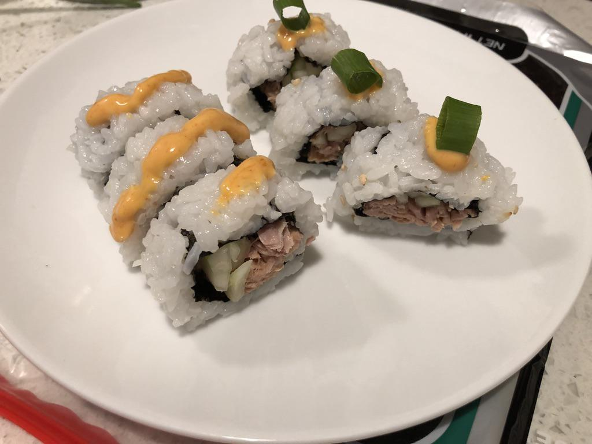

<!-- Do not modify. Auto-generated with mkdocs_migrate.py -->

# Canned Spicy Tuna Roll

> Based on [https://makemysushi.com/Recipes/canned-spicy-tuna-sushi-roll-twist](https://makemysushi.com/Recipes/canned-spicy-tuna-sushi-roll-twist)

Personal rating: :fontawesome-solid-star: :fontawesome-regular-star: :fontawesome-regular-star: :fontawesome-regular-star: :fontawesome-regular-star:

<!-- Image -->
{: .image-recipe loading=lazy }
<!-- /Image -->

## Ingredients

* [ ] 1 tbsp mayo
* [ ] 1 tsp Chili sauce (Sriracha)
* [ ] 1 tsp toasted sesame oil
* [ ] 1/2 tsp lemon juice (optional)
* [ ] spoon of masago (fish roe) (optional)
* [ ] a bit of soy sauce (optional)
* [ ] can tuna
* [ ] sesame seeds
* [ ] cucumber
* [ ] 2 green onions, cut into thin rounds for topping
* [ ] sushi rice
* [ ] nori

## Recipe

* Mix the sauce, then add and mix with the canned tuna
* Cut the Nori sheet in half. Spread rice over the nori and top with sesame seeds, then flip rice side down
* Add the spicy tuna and cucumber and roll
* Top with a dab of spicy mayo and green onion round

## Notes

* See guide on using raw tuna: 
