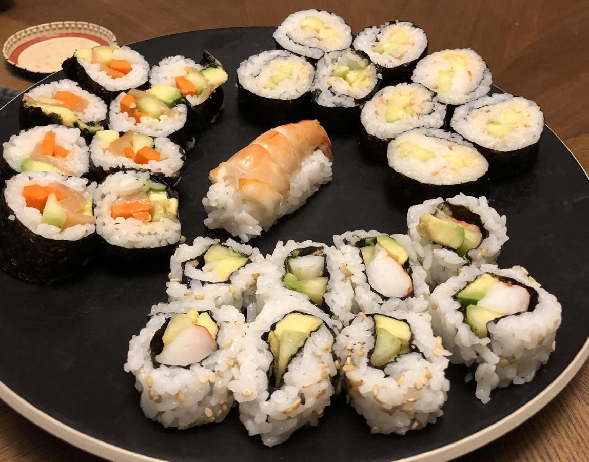

<!-- Do not modify sections with "AUTO-*". They are updated by make.py -->

# Shrimp Nigiri

> Based on [http://www.foodrepublic.com/recipes/how-to-cook-shrimp-for-nigiri-sushi/](http://www.foodrepublic.com/recipes/how-to-cook-shrimp-for-nigiri-sushi/)

<!-- rating=2; (User can specify rating on scale of 1-5) -->
<!-- AUTO-UserRating -->
Personal rating: :fontawesome-solid-star: :fontawesome-solid-star: :fontawesome-regular-star: :fontawesome-regular-star: :fontawesome-regular-star:
<!-- /AUTO-UserRating -->

<!-- AUTO-Image -->
{: .image-recipe loading=lazy }
<!-- /AUTO-Image -->

## Ingredients

* [ ] Shrimp
* [ ] Skewer

## Recipe

* Skewer the shrimp between the belly and shell to keep them straight
* Boil for 2-3 minutes until pink
* Cool in a bowl of ice water
* Peel off the legs, then the shell leaving the tail
* Cut from the head to the tail only down to the intestine. Remove with the tip of the knife without piercing
* Flatten out the shrimp and trim the tail
