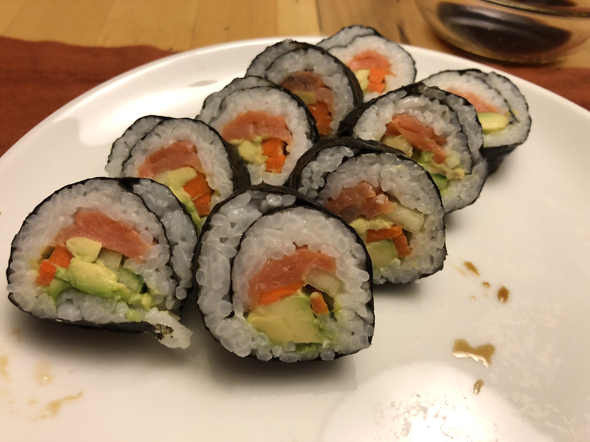

<!-- Needs Manual Review -->

<!-- Do not modify sections with "AUTO-*". They are updated by make.py -->

# Smoked Salmon Rolls

<!-- rating=1; (User can specify rating on scale of 1-5) -->
<!-- AUTO-UserRating -->
Personal rating: :fontawesome-solid-star: :fontawesome-solid-star: :fontawesome-solid-star: :fontawesome-solid-star: :fontawesome-regular-star: :fontawesome-regular-star: :fontawesome-regular-star: :fontawesome-regular-star:
<!-- /AUTO-UserRating -->

<!-- name_image=smoked_salmon_rolls.jpg; (User can specify image name if multiple exist) -->
<!-- AUTO-Image -->
{: .image-recipe loading=lazy }
<!-- /AUTO-Image -->

## Ingredients

* [ ] smoked salmon
* [ ] avocado
* [ ] carrot
* [ ] cucumber
* [ ] wasabi

## Recipe

* Sliced all ingredients into long strips then roll

## Notes

* Can mix rice vinegar or lemon juice to help prevent the avocado from browning
