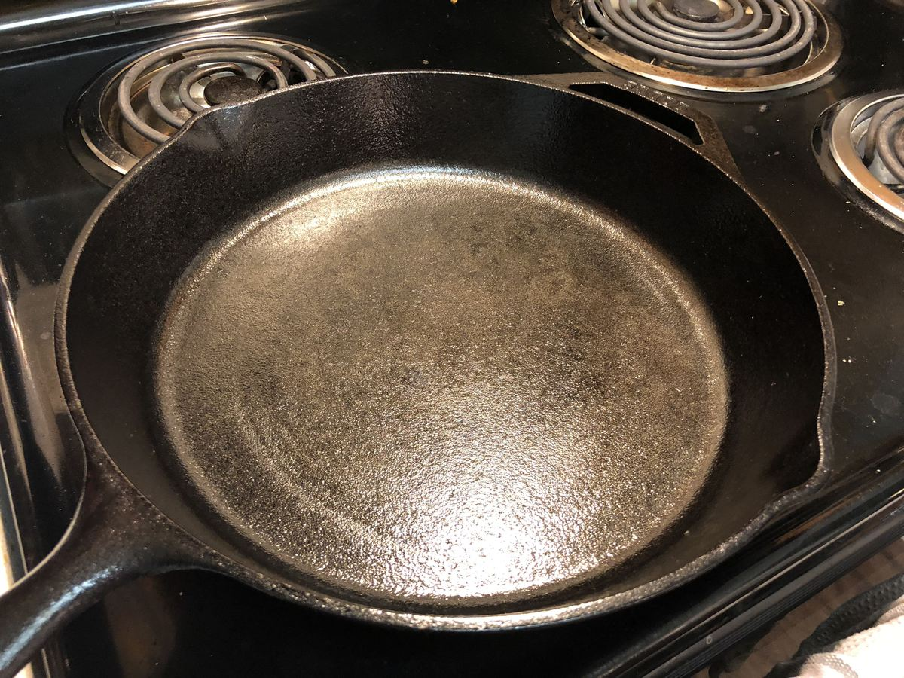

<!-- Needs Manual Review -->

<!-- Do not modify sections with "AUTO-*". They are updated by make.py -->

# Cast Iron Care

> Based on [https://www.youtube.com/watch?v=KLGSLCaksdY](https://www.youtube.com/watch?v=KLGSLCaksdY)

<!-- rating=0; (User can specify rating on scale of 1-5) -->
<!-- AUTO-UserRating -->
Personal rating: *Not yet rated*
<!-- /AUTO-UserRating -->

<!-- name_image=cast_iron_care.jpg; (User can specify image name if multiple exist) -->
<!-- AUTO-Image -->
{: .image-recipe loading=lazy }
<!-- /AUTO-Image -->

## Ingredients

* [ ] Canola or Flaxseed Oil
* [ ] Salt

## Recipe

* >> Seasoning:
* Coat with a thin layer of oil
* Bake at 450F for ~1 hour. This will create a hard glassy layer
* >> Regular Care:
* Clean while still warm and use hot water and a scrub brush (optionally use salt for extra abrasion), but avoid any soap
* Towel dry, then heat to boil off any excess water
* Put on a thin later of oil and heat until smoking to prevent the oil from turning rancid
* >> Notes on Use:
* Always pre-heat the skillet for room temperature food
* Limit the amount of acidic foods to protect the seasoning
