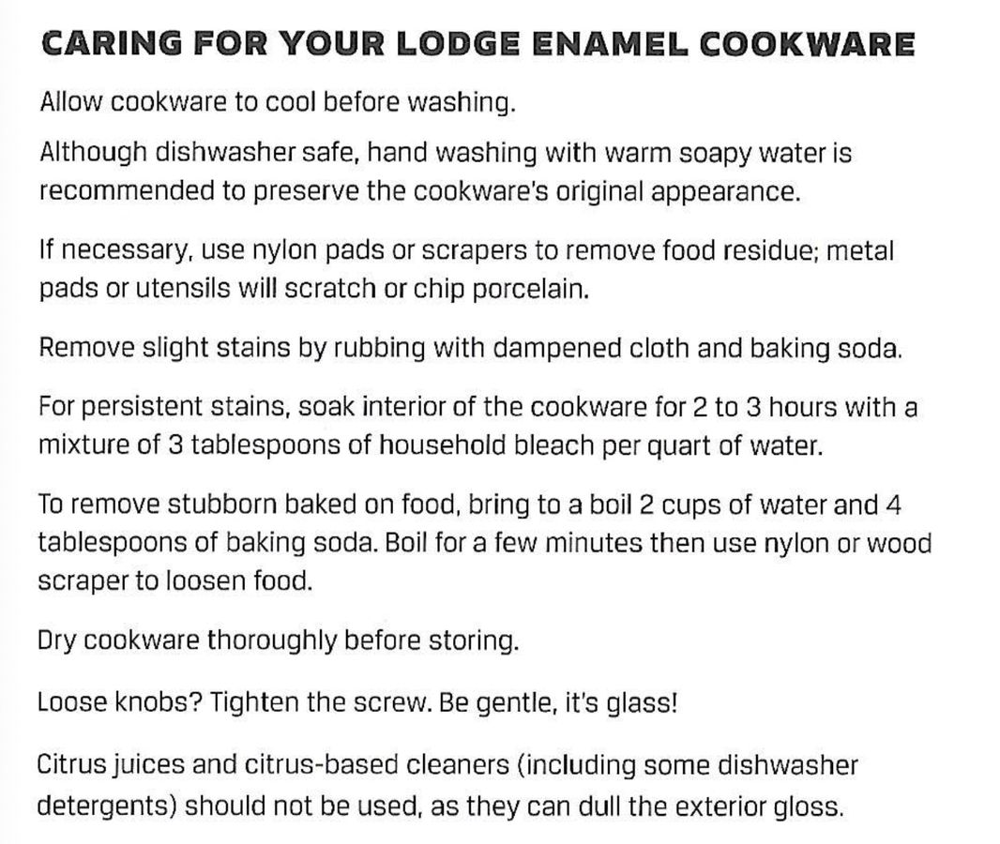

<!-- Needs Manual Review -->

# Porcelain Pot Care

> Based on [https://www.youtube.com/watch?v=KLGSLCaksdY](https://www.youtube.com/watch?v=KLGSLCaksdY)

<!-- {cts} rating=0; (User can specify rating on scale of 1-5) -->
Personal rating: *Not yet rated*
<!-- {cte} -->

<!-- {cts} name_image=porcelain_pot_care.jpg; (User can specify image name) -->
{: .image-recipe loading=lazy }
<!-- {cte} -->

## Ingredients

* [ ] NA

## Recipe

* >> Things to Know
* Porcelain is glass and can be prone to chipping. Oven safe to 500. Can be used to refrigerate
* >> Cook
* Do not use high heat. Stick to medium at most. Do not use metal utensils. Do not heat empty
* >> Care
* Warm soapy water. Can use baking soda for stains/see other notes in image
