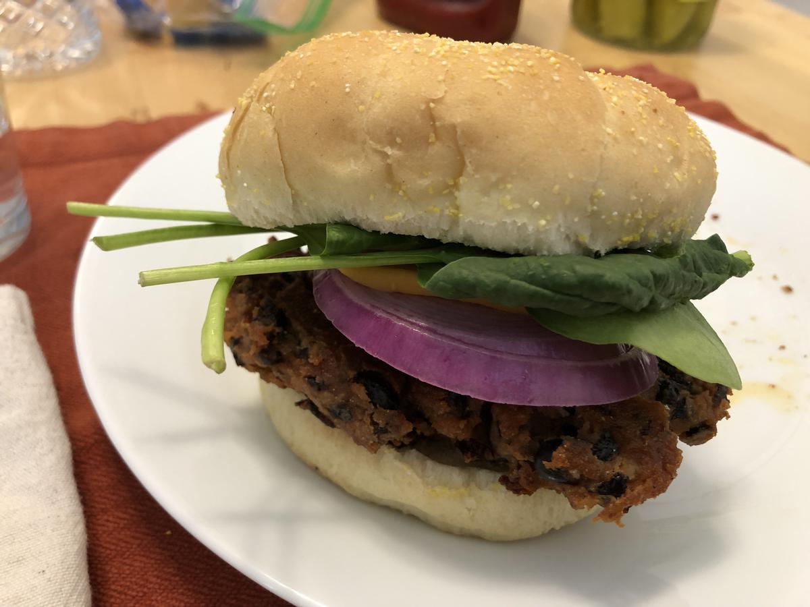

# Table of Contents (Veggie)

| Link                                                                                                      |   Rating | Image                                                                                                                         |
|:----------------------------------------------------------------------------------------------------------|---------:|:------------------------------------------------------------------------------------------------------------------------------|
| [Baked Broccoli](./baked_broccoli.md)                                                                     |        5 | {: .image-toc loading=lazy }                                                       |
| [Baked Potatoes](./baked_potatoes.md)                                                                     |        4 | {: .image-toc loading=lazy }                                                       |
| [Baked Potatoes Instant Pot](./baked_potatoes_instant_pot.md)                                             |        4 | {: .image-toc loading=lazy }                               |
| [Baked Zucchini](./baked_zucchini.md)                                                                     |        6 | {: .image-toc loading=lazy }                                                     |
| [Black Bean Burger](./black_bean_burger.md)                                                               |        8 | {: .image-toc loading=lazy }                                               |
| [Cauliflower Lime Burrito Bowl](./cauliflower_lime_burrito_bowl.md)                                       |        8 | {: .image-toc loading=lazy }                       |
| [Chana Masala](./chana_masala.md)                                                                         |        4 | {: .image-toc loading=lazy }                                                         |
| [Chickpea Greek Salad Wrap](./chickpea_greek_salad_wrap.md)                                               |        5 | {: .image-toc loading=lazy }                               |
| [Chickpea Salad Toasts With Poached Egg](./chickpea_salad_toasts_with_poached_egg.md)                     |        6 | {: .image-toc loading=lazy }     |
| [Chickpea Salad Wrap](./chickpea_salad_wrap.md)                                                           |        5 | {: .image-toc loading=lazy }                                           |
| [Chickpea Spicy Buffalo Wrap](./chickpea_spicy_buffalo_wrap.md)                                           |        3 | <!-- TODO: Capture image -->                                                                                                  |
| [Chili Lime Black Bean Tacos](./chili_lime_black_bean_tacos.md)                                           |        7 | {: .image-toc loading=lazy }                           |
| [Crispy Baked Sweet Potato Fries](./crispy_baked_sweet_potato_fries.md)                                   |        3 | <!-- TODO: Capture image -->                                                                                                  |
| [Curried Chickpeas](./curried_chickpeas.md)                                                               |        5 | {: .image-toc loading=lazy }                                                 |
| [Falafel Pitas With Cilantro Cashew Sauce](./falafel_pitas_with_cilantro_cashew_sauce.md)                 |        6 | {: .image-toc loading=lazy } |
| [Ginger Orange Broccoli And Noodles](./ginger_orange_broccoli_and_noodles.md)                             |        6 | {: .image-toc loading=lazy }             |
| [Green Chile Mac](./green_chile_mac.md)                                                                   |        3 | <!-- TODO: Capture image -->                                                                                                  |
| [Guacamole](./guacamole.md)                                                                               |        3 | <!-- TODO: Capture image -->                                                                                                  |
| [Instant Pot Stuffed Bell Peppers](./instant_pot_stuffed_bell_peppers.md)                                 |        3 | <!-- TODO: Capture image -->                                                                                                  |
| [Instant Pot Vegetarian Chili](./instant_pot_vegetarian_chili.md)                                         |        3 | <!-- TODO: Capture image -->                                                                                                  |
| [Karens Roasted Veggie Bowls](./karens_roasted_veggie_bowls.md)                                           |        5 | <!-- TODO: Capture image -->                                                                                                  |
| [Mediterranean Cauliflower Platter](./mediterranean_cauliflower_platter.md)                               |        3 | <!-- TODO: Capture image -->                                                                                                  |
| [Oven Roasted Asparagus](./oven_roasted_asparagus.md)                                                     |        8 | {: .image-toc loading=lazy }                                     |
| [Polenta With White Beans And Italian Salsa Verde](./polenta_with_white_beans_and_italian_salsa_verde.md) |        3 | <!-- TODO: Capture image -->                                                                                                  |
| [Roasted Vegetables](./roasted_vegetables.md)                                                             |        5 | {: .image-toc loading=lazy }                                               |
| [Salad](./salad.md)                                                                                       |        6 | {: .image-toc loading=lazy }                                                                         |
| [Sweet Potato Gnocchi](./sweet_potato_gnocchi.md)                                                         |        5 | {: .image-toc loading=lazy }                                         |
| [Sweet Potatoes](./sweet_potatoes.md)                                                                     |        3 | <!-- TODO: Capture image -->                                                                                                  |
| [Vegetable Wraps](./vegetable_wraps.md)                                                                   |        3 | <!-- TODO: Capture image -->                                                                                                  |
| [Veggie Couscous With Spicy Pine Nuts](./veggie_couscous_with_spicy_pine_nuts.md)                         |        7 | {: .image-toc loading=lazy }         |
| [Veggie Loaded Red Curry](./veggie_loaded_red_curry.md)                                                   |        6 | {: .image-toc loading=lazy }                                   |
