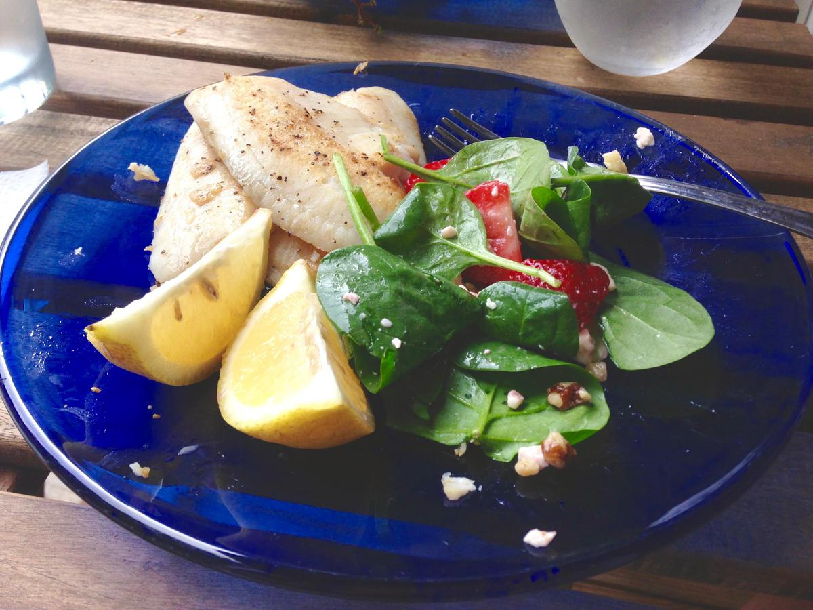

# Veggie Table of Contents

- Chana Masala (:fontawesome-solid-star: :fontawesome-solid-star: :fontawesome-solid-star: :fontawesome-solid-star: :fontawesome-regular-star: :fontawesome-regular-star: :fontawesome-regular-star: :fontawesome-regular-star:)

    {: .image-recipe loading=lazy }

- Roasted Vegetables (:fontawesome-solid-star: :fontawesome-solid-star: :fontawesome-solid-star: :fontawesome-solid-star: :fontawesome-solid-star: :fontawesome-regular-star: :fontawesome-regular-star: :fontawesome-regular-star:)

    {: .image-recipe loading=lazy }

- Baked Potatoes Instant Pot (:fontawesome-solid-star: :fontawesome-solid-star: :fontawesome-solid-star: :fontawesome-solid-star: :fontawesome-regular-star: :fontawesome-regular-star: :fontawesome-regular-star: :fontawesome-regular-star:)

    {: .image-recipe loading=lazy }

- Mediterranean Cauliflower Platter (*Not yet rated*)

    <!-- TODO: Capture image -->

- Chickpea Greek Salad Wrap (:fontawesome-solid-star: :fontawesome-solid-star: :fontawesome-solid-star: :fontawesome-solid-star: :fontawesome-solid-star: :fontawesome-regular-star: :fontawesome-regular-star: :fontawesome-regular-star:)

    {: .image-recipe loading=lazy }

- Chili Lime Black Bean Tacos (*Not yet rated*)

    <!-- TODO: Capture image -->

- Baked Zucchini (:fontawesome-solid-star: :fontawesome-solid-star: :fontawesome-solid-star: :fontawesome-solid-star: :fontawesome-solid-star: :fontawesome-solid-star: :fontawesome-regular-star: :fontawesome-regular-star:)

    {: .image-recipe loading=lazy }

- Guacamole (*Not yet rated*)

    <!-- TODO: Capture image -->

- Vegetable Wraps (*Not yet rated*)

    <!-- TODO: Capture image -->

- Chickpea Spicy Buffalo Wrap (*Not yet rated*)

    <!-- TODO: Capture image -->

- Baked Broccoli (:fontawesome-solid-star: :fontawesome-solid-star: :fontawesome-solid-star: :fontawesome-solid-star: :fontawesome-solid-star: :fontawesome-regular-star: :fontawesome-regular-star: :fontawesome-regular-star:)

    {: .image-recipe loading=lazy }

- Crispy Baked Sweet Potato Fries (*Not yet rated*)

    <!-- TODO: Capture image -->

- Green Chile Mac (*Not yet rated*)

    <!-- TODO: Capture image -->

- Chickpea Salad Toasts With Poached Egg (*Not yet rated*)

    <!-- TODO: Capture image -->

- Polenta With White Beans And Italian Salsa Verde (*Not yet rated*)

    <!-- TODO: Capture image -->

- Falafel Pitas With Cilantro Cashew Sauce (*Not yet rated*)

    <!-- TODO: Capture image -->

- Karens Roasted Veggie Bowls (:fontawesome-solid-star: :fontawesome-solid-star: :fontawesome-solid-star: :fontawesome-solid-star: :fontawesome-solid-star: :fontawesome-regular-star: :fontawesome-regular-star: :fontawesome-regular-star:)

    <!-- TODO: Capture image -->

- Sweet Potato Gnocchi (:fontawesome-solid-star: :fontawesome-solid-star: :fontawesome-solid-star: :fontawesome-solid-star: :fontawesome-solid-star: :fontawesome-regular-star: :fontawesome-regular-star: :fontawesome-regular-star:)

    {: .image-recipe loading=lazy }

- Veggie Loaded Red Curry (:fontawesome-solid-star: :fontawesome-solid-star: :fontawesome-solid-star: :fontawesome-solid-star: :fontawesome-solid-star: :fontawesome-solid-star: :fontawesome-regular-star: :fontawesome-regular-star:)

    {: .image-recipe loading=lazy }

- Chickpea Salad Wrap (:fontawesome-solid-star: :fontawesome-solid-star: :fontawesome-solid-star: :fontawesome-solid-star: :fontawesome-solid-star: :fontawesome-regular-star: :fontawesome-regular-star: :fontawesome-regular-star:)

    {: .image-recipe loading=lazy }

- Salad (:fontawesome-solid-star: :fontawesome-solid-star: :fontawesome-solid-star: :fontawesome-solid-star: :fontawesome-solid-star: :fontawesome-solid-star: :fontawesome-regular-star: :fontawesome-regular-star:)

    {: .image-recipe loading=lazy }

- Sweet Potatoes (*Not yet rated*)

    <!-- TODO: Capture image -->

- Ginger Orange Broccoli And Noodles (*Not yet rated*)

    {: .image-recipe loading=lazy }

- Curried Chickpeas (:fontawesome-solid-star: :fontawesome-solid-star: :fontawesome-solid-star: :fontawesome-solid-star: :fontawesome-solid-star: :fontawesome-regular-star: :fontawesome-regular-star: :fontawesome-regular-star:)

    {: .image-recipe loading=lazy }

- Baked Potatoes (:fontawesome-solid-star: :fontawesome-solid-star: :fontawesome-solid-star: :fontawesome-solid-star: :fontawesome-regular-star: :fontawesome-regular-star: :fontawesome-regular-star: :fontawesome-regular-star:)

    {: .image-recipe loading=lazy }