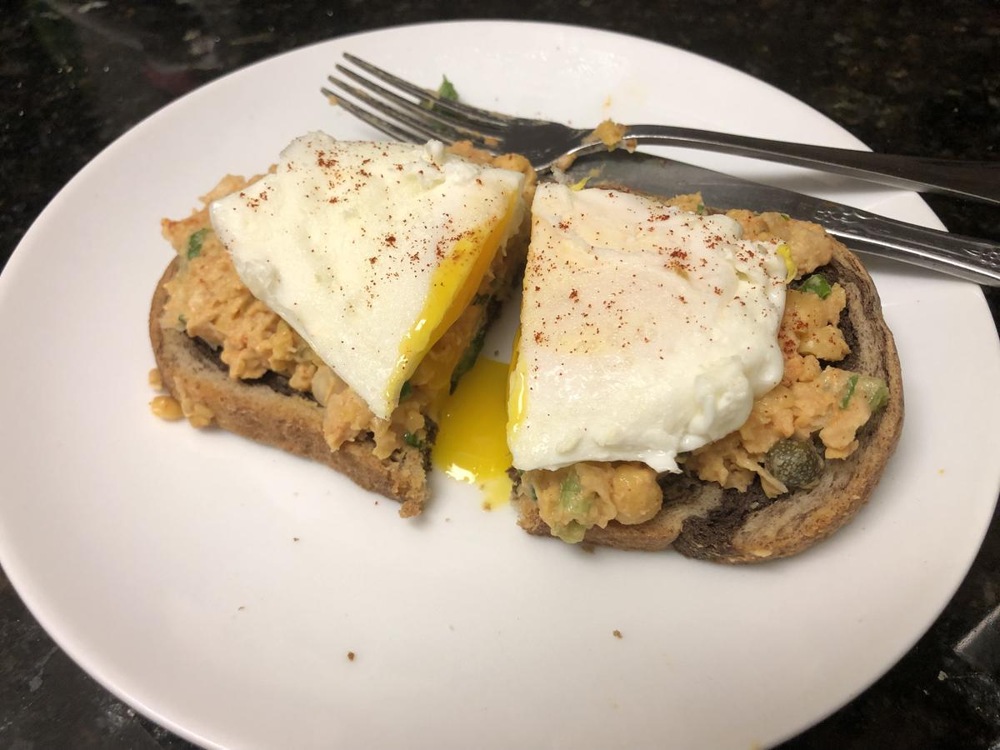

# Chickpea Salad Toasts With Poached Egg

> Based on [https://www.washingtonpost.com/recipes/chickpea-salad-toasts-poached-egg/17012](https://www.washingtonpost.com/recipes/chickpea-salad-toasts-poached-egg/17012)

<!-- {cts} rating=3; (User can specify rating on scale of 1-5) -->
Personal rating: :fontawesome-solid-star: :fontawesome-solid-star: :fontawesome-solid-star: :fontawesome-solid-star: :fontawesome-solid-star: :fontawesome-solid-star: :fontawesome-regular-star: :fontawesome-regular-star:
<!-- {cte} -->

<!-- {cts} name_image=chickpea_salad_toasts_with_poached_egg.jpeg; (User can specify image name) -->
{: .image-recipe loading=lazy }
<!-- {cte} -->

## Ingredients

### Toasts

* [ ] 15.5 oz can chickpeas, drained
* [ ] 1 celery rib, finely chopped
* [ ] 2 scallions, trimmed and thinly sliced (white and green parts)
* [ ] 2 tbsp capers, drained
* [ ] 1 tbsp mayonnaise
* [ ] 1 tsp Dijon mustard
* [ ] 2 tsps white wine vinegar
* [ ] 1/2 tsp Spanish smoked paprika (pimentón), plus more for garnish
* [ ] 1/2 tsp kosher salt
* [ ] 4 slices artisan-style bread, toasted

> Note: the scallions and/or celery can be replaced with a sweet onion

### Eggs (Optional)

* [ ] 1 tsp white wine vinegar
* [ ] 4 large eggs

## Recipe

* *Chickpea salad*: Place the chickpeas in a medium bowl and smash with a potato masher or fork until most of them are broken down. Add the celery, scallions, capers, mayonnaise, Dijon mustard, white wine vinegar, smoked paprika, and salt. Stir gently to incorporate
* *Eggs*: Pour at least 2 inches of water into a large skillet. Stir in the white wine vinegar and heat over medium-high heat until the water is at a low simmer, just before bubbles start to rise off the bottom of the pan
    * Crack one egg into a small bowl and use the bowl to gently slide the egg into the water. Repeat for the remaining eggs. Don't worry if the egg whites spread out a bit as you add them. Cook without stirring for 4 minutes. Use a slotted spoon to transfer the eggs to a plate and cover loosely to keep warm
* *Serve*: spread equal amounts of the chickpea salad on the toasted bread slices, then top with poached eggs. Sprinkle a little smoked paprika on each egg (eat with a knife and fork)
