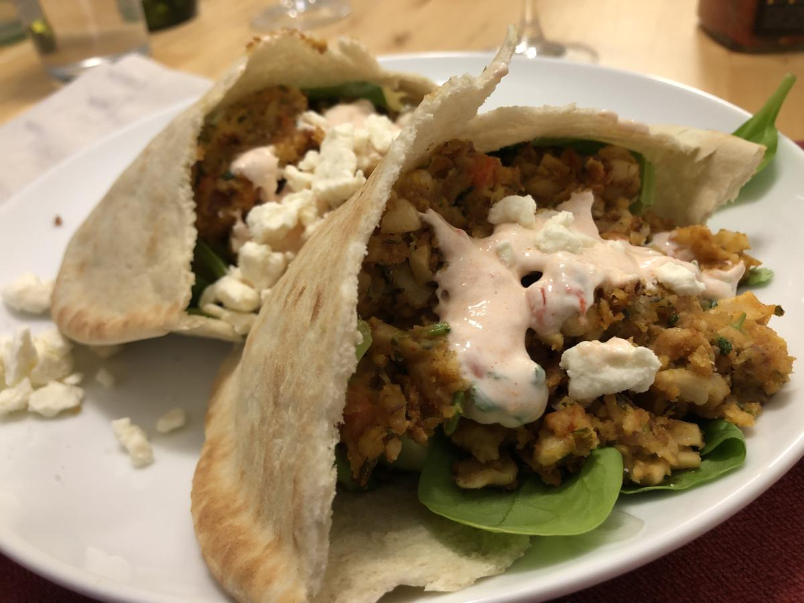

# Falafel Pitas With Cilantro-Cashew Sauce

> Based on [https://www.washingtonpost.com/recipes/falafel-pitas-cilantro-cashew-sauce/17090/?utm_campaign=plant_powered_week_7&utm_medium=Email&utm_source=Newsletter&wpisrc=nl_vplantpowered_w7&wpmm=1](https://www.washingtonpost.com/recipes/falafel-pitas-cilantro-cashew-sauce/17090/?utm_campaign=plant_powered_week_7&utm_medium=Email&utm_source=Newsletter&wpisrc=nl_vplantpowered_w7&wpmm=1)

<!-- {cts} rating=3; (User can specify rating on scale of 1-5) -->

Personal rating: :fontawesome-solid-star: :fontawesome-solid-star: :fontawesome-solid-star: :fontawesome-regular-star: :fontawesome-regular-star:

<!-- {cte} -->

<!-- {cts} name_image=falafel_pitas_with_cilantro_cashew_sauce.jpeg; (User can specify image name) -->

{: .image-recipe loading=lazy }

<!-- {cte} -->

## Ingredients

### For The Sauce

> See note at bottom for alternative yogurt-based sauce instead of cashew-based

- [ ] 1 cup (5 oz) raw, unsalted cashews, soaked (10-12 hours!)
- [ ] 1/2 bunch fresh cilantro leaves (1 cup packed)
- [ ] 1/2 cup water, or more as needed
- [ ] 1/4 cup fresh lemon juice (from 1 large lemon)
- [ ] 1/2 tsp kosher salt
- [ ] 1/8 tsp ground cayenne pepper

### For The Falafel

- [ ] Can of chickpeas, mashed with potato masher
    - [ ] Note that 1-2 tbsp of flour can be added if needed to help the falafel hold their shape
- [ ] 2 medium cloves garlic
- [ ] 1/4 medium red onion, finely chopped (about 1/4 cup)
- [ ] 1/2 small carrot, scrubbed well and finely chopped (about 1/4 cup)
- [ ] 1 tbsp cilantro stems, finely chopped
- [ ] 1/3 cup loosely packed parsley leaves
- [ ] 1.5 tsp ground cumin
- [ ] 1 tsp kosher salt
- [ ] olive oil

### For Serving

- [ ] 4 pita bread rounds, each cut in half
- [ ] 1/2 English (seedless) cucumber, thinly sliced into rounds
- [ ] 1/2 cup thinly sliced red onion
- [ ] 1 cup (2 oz) baby spinach
- [ ] 1 cup cherry tomatoes, chopped
- [ ] Mild harissa (store-bought; optional)

## Recipe

- Soak the raw cashews with ~2 cups of water for 10-12 hours in a large tupperware
    - Drain and return the nuts to the tupperware. Using a potato masher and fork, mash until no chunks remain
    - Finely chop and mix-in the cilantro, lemon juice, salt, and cayenne pepper. Mix with a fork
        - Add water as needed to achieve a creamy consistency
    - (If available, this is much easier with a food processor or good blender)
- For the falafel
    - In a new container, drain the chickpeas and mash with a potato masher and fork (or use a food processor if available)
    - Add the finely chopped garlic, red onion, carrot, cilantro stems, and parsley. Add the cumin and salt
    - Taking a tbsp of dough and flatten into a 2" round
        - You should now have a crumbly dough, but if two wet, add 1-2 tbsp of flour to help the dough stick together
    - Prep about 24 disks on a plate
- Cut up the vegetables for serving
- Heat up a thin layer of oil on the skillet under medium-high heat
    - Once sizzling, cook 8 falafel at a time for 2-3 min per side until lightly browned
    - We used a spatula and fork to flip, but if they stick together better, apparently chopsticks work well
    - Add more oil for each batch until done
- To serve
    - Stuff each of the pita halves with 3 falafel, cucumber slices, red onion, spinach and tomatoes
    - Dollop with enough cilantro-cashew sauce to cover the filling, and some harissa, if using

## Notes

- I really messed up this recipe the first time we made it. I mashed the cashews and chickpeas, so the falafel didn't stay together and we didn't have the cashew sauce :D
    - The meal was saved thanks to Alex's quick thinking of whipping together a yogurt sauce with plain yogurt, finely chopped cilantro, lemon juice, salt, and harissa
    - This sauce could probably be improved, but was a nice way to serve the falafel if one doesn't have cashews
