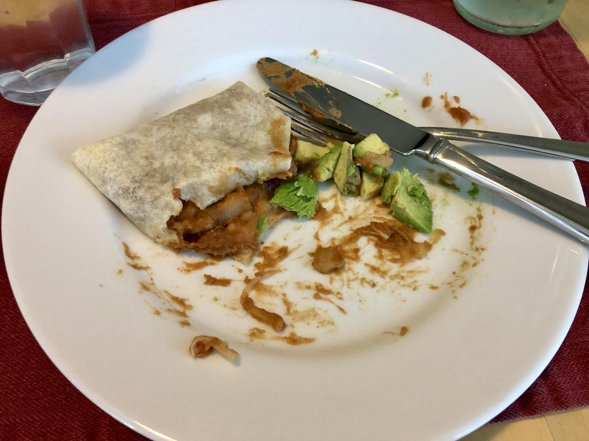

# Refried Bean Burritos

> Based on [https://www.spoonfulofflavor.com/sweet-potato-black-bean-quinoa-bowls/](https://www.spoonfulofflavor.com/sweet-potato-black-bean-quinoa-bowls/)

<!-- {cts} rating=4; (User can specify rating on scale of 1-5) -->

Personal rating: :fontawesome-solid-star: :fontawesome-solid-star: :fontawesome-solid-star: :fontawesome-solid-star: :fontawesome-solid-star: :fontawesome-solid-star: :fontawesome-solid-star: :fontawesome-regular-star:

<!-- {cte} -->

<!-- {cts} name_image=refried_bean_burritos.jpeg; (User can specify image name) -->

{: .image-recipe loading=lazy }

<!-- {cte} -->

## Ingredients

- [ ] 1 (16-oz) can refried beans
- [ ] 1/2 cup chunky salsa
- [ ] 1/4 cup diced onion
- [ ] 1 tsp taco seasoning
- [ ] 1/4 tsp kosher salt, plus more to taste
- [ ] 2 cup shredded cheddar cheese
- [ ] 4 (10-inch) burrito sized tortillas

## Recipe

- Preheat oven to 375F and pull out a large sheet pan
- In a medium bowl, mix refried beans, salsa, onion, taco seasoning, and salt
- For each tortilla:
    - Spread 1/4 of the mixture evenly; leave an inch from the end empty
    - Sprinkle 1/2 cup of cheese over the top of each
    - Wrap up the burrito making sure to tuck in the sides
    - Lay seam side down spread out on the sheet pan
- Transfer to the oven and bake 12-15 min
