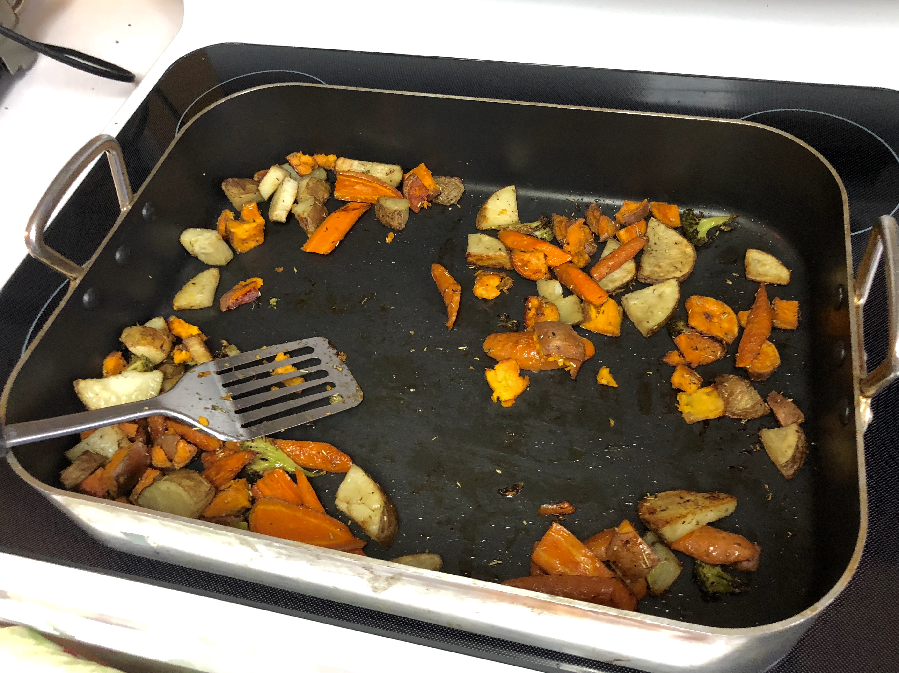

# Roasted Vegetables

<!-- {cts} rating=5; (User can specify rating on scale of 1-5) -->

Personal rating: :fontawesome-solid-star: :fontawesome-solid-star: :fontawesome-solid-star: :fontawesome-solid-star: :fontawesome-solid-star: :fontawesome-solid-star: :fontawesome-solid-star: :fontawesome-solid-star:

<!-- {cte} -->

<!-- {cts} name_image=roasted_vegetables.jpg; (User can specify image name) -->

{: .image-recipe loading=lazy }

<!-- {cte} -->

## Ingredients

### Seasonings

* [ ] Olive Oil
* [ ] (Standard) Thyme, Rosemary, Garlic, Onion, and Salt and pepper
* [ ] (Alternative) Paprika, Thyme, Garlic, and Onion

### Veggies

* [ ] Potatoes
* [ ] Sweet potatoes
* [ ] Carrots
* [ ] Broccoli
* [ ] Mushrooms
* [ ] Butternut or yellow squash
* [ ] Zucchini
* [ ] Red bell pepper
* [ ] Red onion

## Recipe

* Set the oven to 425 (no need to wait for pre-heat)
* Cut up all the vegetables into roughly the same size
* Mix with seasonings and oil in a bowl, then spread out over two baking sheets or in a roasting pan
* Bake for 30 minutes, check and flip, then bake for an additional 30 min
* Wait to add the software ingredients, such as mushrooms, zucchini, etc. until the mid-point
