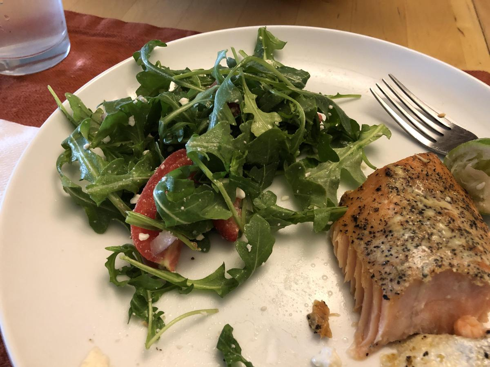

<!-- Do not modify sections with "AUTO-*". They are updated by make.py -->

# Salad

<!-- rating=3; (User can specify rating on scale of 1-5) -->
<!-- AUTO-UserRating -->
Personal rating: :fontawesome-solid-star: :fontawesome-solid-star: :fontawesome-solid-star: :fontawesome-regular-star: :fontawesome-regular-star:
<!-- /AUTO-UserRating -->

<!-- name_image=salad.jpg; (User can specify image name if multiple exist) -->
<!-- AUTO-Image -->
{: .image-recipe loading=lazy }
<!-- /AUTO-Image -->

## Ingredients

## Recipe

* Feta: arugula/spinach, red onion, tomato, cucumber, feta, dressing (olive oil + lime)
* Feta+: (above) + strawberries or black beans
* Strawb: spinach, strawberry, feta, walnuts/pecans/almonds
* Greek: lettuce, cherry tomatoes, peppers, cucumber, onion, feta, (opt: chickpeas)
* Caesar: lettuce, Parmesan, chicken, croutons
* Rotisserie: lettuce, tomato, cucumber, pepper, etc, rotisserie chicken

## Notes

* Typically, cut tomatoes into orange-sized slices
* Dressings: Ken's Steak House LITE Northern Italian or LITE Zesty Italian
