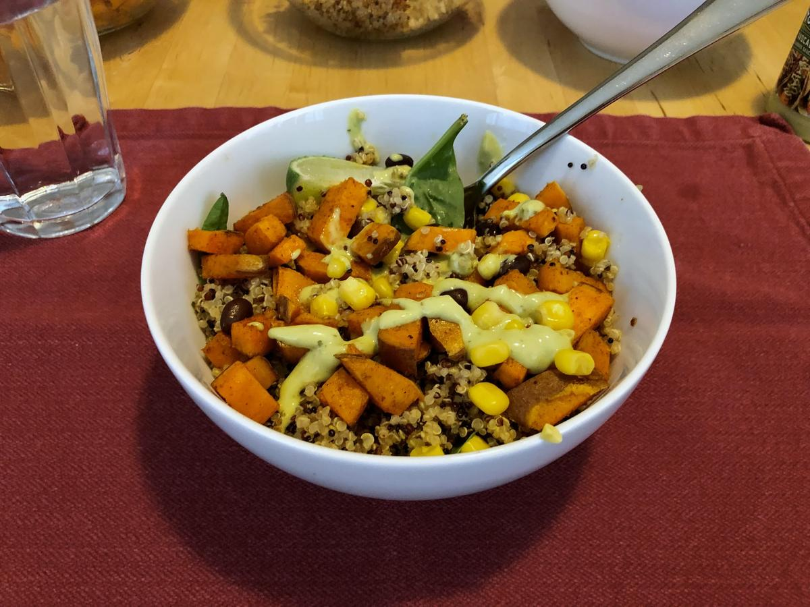

# Sweet Potato and Black Bean Quinoa Bowls

> Based on [https://www.spoonfulofflavor.com/sweet-potato-black-bean-quinoa-bowls/](https://www.spoonfulofflavor.com/sweet-potato-black-bean-quinoa-bowls/)

<!-- {cts} rating=4; (User can specify rating on scale of 1-5) -->

Personal rating: :fontawesome-solid-star: :fontawesome-solid-star: :fontawesome-solid-star: :fontawesome-solid-star: :fontawesome-regular-star:

<!-- {cte} -->

<!-- {cts} name_image=sweet_potato_and_black_bean_quinoa_bowls.jpeg; (User can specify image name) -->

{: .image-recipe loading=lazy }

<!-- {cte} -->

## Ingredients

### Roasted Sweet Potato:

- [ ] 1 large sweet potato, peel and diced
- [ ] 1 tsp extra virgin olive oil
- [ ] 1/2 tsp chili powder
- [ ] 1/4 tsp cumin
- [ ] 1/4 tsp kosher salt

### Cilantro Cream Drizzle:

- [ ] 1/4 cup plain non fat Greek yogurt
- [ ] 1/4 cup cilantro, chopped
- [ ] 1/4 tsp agave nectar or honey
- [ ] Juice of half a lime
- [ ] Pinch of salt, garlic powder, and chili powder

### Quinoa:

- [ ] 1.5 cup red quinoa
- [ ] 3 cups water
- [ ] 1 tsp kosher salt, divided
- [ ] 1 tsp chili powder
- [ ] 1 tsp cumin
- [ ] 1/2 tsp garlic powder
- [ ] Juice of half a lime
- [ ] 3 tbsp cilantro, chopped

### Other Ingredients:

- [ ] 1 cup black beans, rinsed and drained
- [ ] Cilantro for garnishing

## Recipe

- Start the quinoa in a rice cooker
- Roast the Sweet Potato:
    - Preheat oven to 425F. Prepare a large baking sheet with a baking mat, foil, or cooking spray
    - Toss the diced sweet potato in the olive oil and spices. Spread out in an even layer on the baking sheet
    - Roast the sweet potato for 12-15 minutes or until it is fork tender
- For the Cilantro Cream Drizzle, in a blender, add all of the ingredients and blend until smooth
- Once the quinoa is done, season with the specified spices
- Assembling the Bowls:
    - In 2 or 3 serving bowls divide the quinoa mixture
    - Top the quinoa with the black beans and roasted sweet potato
    - Drizzle the cilantro cream on top with a spoon. Top with more cilantro if desired.
